# Лабораторная работа №1. Задачи

## Комплект 1: Начала программирование.
## Операторы, вычисления, ввод-вывод.

### Задача 1.2 - написать простую программу для вычисления суммы двух чисел

#### Постановка задачи

Написать простую программу. Ввести два числа с клавиатуры, вычислить их сумму и напечатать результат. Использовать функцию printf для приглашений на ввод и для распечатки результата. Использовать функцию scanf для ввода каждого числа отдельно с клавиатуры. Для получения доступа к функциям printf и scanf включить в програм му заголовочный файл stdio.h. Использовать корректные спецификаторы форматирования. Здесь и далее для распечатки надписей на экране использовать латинские буквы для избежания проблем с кодировками символов.

#### Математическая модель

Пусть заданы два числа: a и b.

Требуется вычислить их сумму:

S = a + b

#### Список идентификаторов

| Имя переменной | Тип данных |   Описание   |
|----------------|------------|--------------|
| a              |   double   | первое число |
| b              |   double   | второе число |
| sum            |   double   | сумма чисел  |

#### Код программы

```c
#include <stdio.h>

int main() {
    double a, b;
    printf("Enter a number: ");
    scanf("%lf", &a);
    printf("Enter b number: ");
    scanf("%lf", &b);

    printf("Sum a+b = %.2lf", a+b);
    return 0;
}
```

#### Результат работы программы

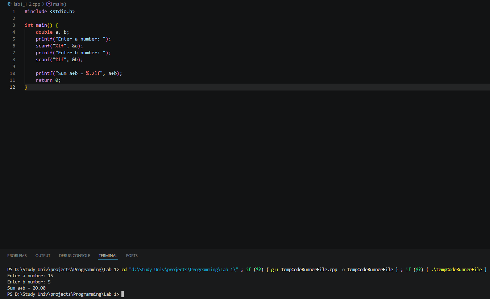

### Задача 1.3 - Вычислить значение выражения

#### Постановка задачи

Вычислить значение выражения:

$$
u(x,y) = \frac{1 + \sin^2(x + y)}{2 + \left| x - \frac{2x^2}{1 + \left| \sin(x + y) \right|} \right|},
$$

введя $x$ и $y$ с клавиатуры. Подберите значения аргументов x и y самостоятельно за исключением тривиальных значений. Напечатайте вычисленное значение $u(x,y)$ на экране. Включить в программу заголовочный файл math.h для доступа к математическим функциям.

#### Математическая модель

Заданы вещественные числа $x$ и $y$.

Вычислить значение функции:

$$
u(x,y) = \frac{1 + \sin^2(x + y)}{2 + \left| x - \frac{2x^2}{1 + \left| \sin(x + y) \right|} \right|},
$$

#### Список идентификаторов

| Имя переменной | Тип данных |   Описание               |
|----------------|------------|--------------------------|
| x              |   double   | первое число             |
| y              |   double   | второе число             |
| sum            |   double   | сумма чисел              |
| sin_xy         |   double   | синус двух чисел         |
| numerator      |   double   | числитель дроби функции  |
| denominator    |   double   | знаменатель дроби функции|
| res            |   double   | результат                |

#### Код программы

```c
#include <stdio.h>
#include <math.h>

double fun(double x, double y) {
    double sum = x + y;
    double sin_xy = sin(sum);
    // Числитель
    double numerator = 1 + sin_xy * sin_xy; // Можно использовать pow, но при квадрате не имеет смысла
    // Знаменатель
    double denominator = 2 + fabs(x - (2 * x * x) / (1 + fabs(sin_xy)));

    double res = numerator / denominator;
    return res;
}

int main() {
    double x, y;

    printf("Enter x number: ");
    scanf("%lf", &x);
    printf("Enter y number: ");
    scanf("%lf", &y);

    printf("Result = %lf", fun(x, y));
    return 0;
}
```

#### Результат работы программы

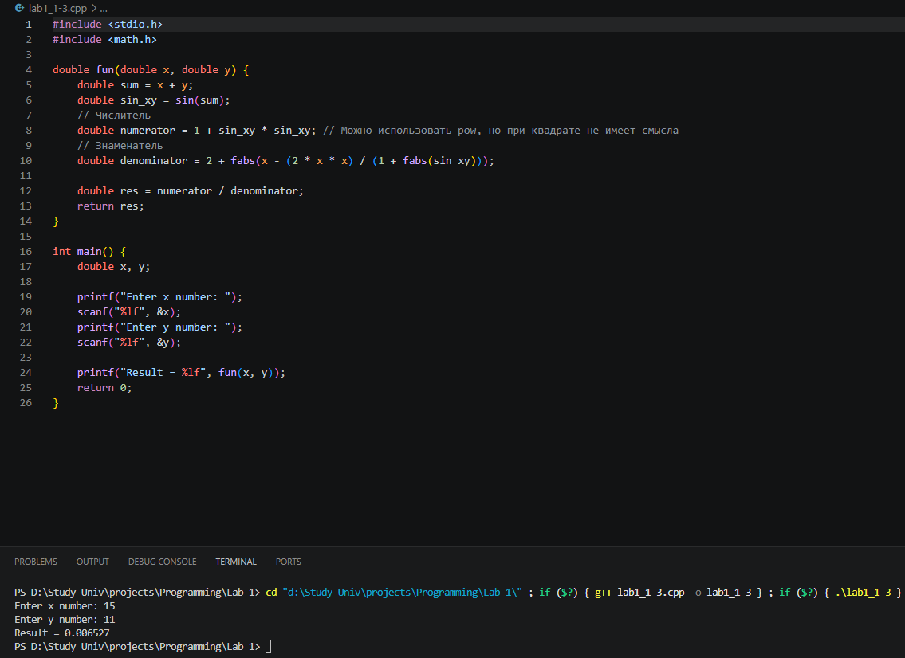

### Задача 1.4 - Вычислить значение выражения

#### Постановка задачи

Вычислить значение выражения:

$$
h(x) = -\frac{x - a}{\sqrt[3]{x^2 - a^2}} - \frac{4\sqrt[4]{(x^2 + b^2)^3}}{2 + a + b + \sqrt[3]{(x - c)^2}}
$$

Выполнить для следующих значений:

$$a =0.12,b = 3.5,c = 2.4,x = 1.4;$$

$$a =0.12,b = 3.5,c = 2.4,x = 1.6;$$

$$a =0.27,b = 3.9,c = 2.8,x = 1.8.$$

Значения параметров иаргументов можно вводить прямо в коде программы без ввода с клавиатуры.

#### Математическая модель

$$
h(x) = -\frac{x - a}{\sqrt[3]{x^2 - a^2}} - \frac{4\sqrt[4]{(x^2 + b^2)^3}}{2 + a + b + \sqrt[3]{(x - c)^2}}
$$

#### Список идентификаторов

| Имя переменной | Тип данных |   Описание               |
|----------------|------------|--------------------------|
| x              |   double   | первое число             |
| a              |   double   | второе число             |
| b              |   double   | третье число             |
| c              |   double   | четвертое число          |
| left           |   double   | левая дробь              |
| right          |   double   | правая дробь             |
| res            |   double   | результат                |

#### Код программы

```c
#include <stdio.h>
#include <math.h>

double fun(double x, double a, double b, double c) {
    double left = -((x - a) / (cbrt(x * x + a * a)));
    double right = (4 * sqrt(sqrt(pow((x * x + b * b), 3)))) / (2 + a + b + cbrt(pow(x - c, 2)));
    double res = left - right;
    return res;
}

int main() {
    printf("Result 1 = %lf\n", fun(1.4, 0.12, 3.5, 2.4));
    printf("Result 2 = %lf\n", fun(1.6, 0.12, 3.5, 2.4));
    printf("Result 3 = %lf", fun(1.8, 0.27, 3.9, 2.8));
    return 0;
}
```

#### Результат работы программы

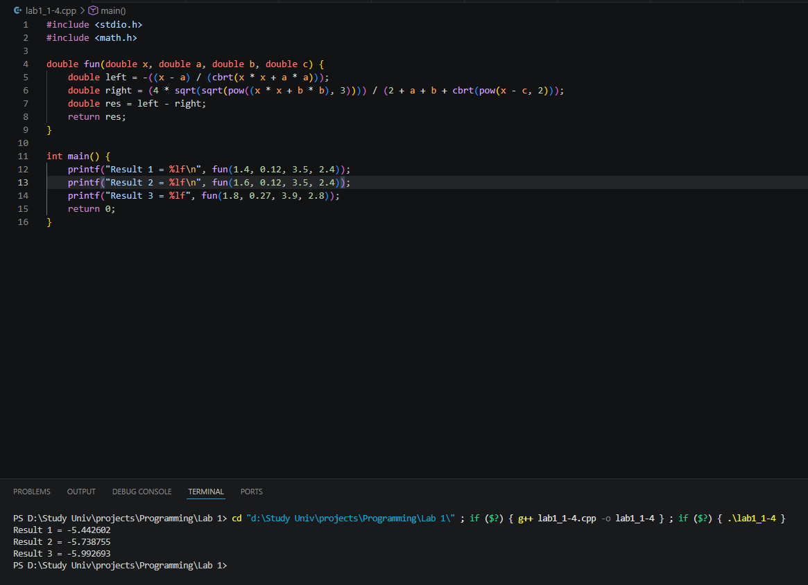

## Комплект 2: Организация циклов. Условные конструкции

### Задача 2.1 - Вычислить координаты Марса относительно Земли

#### Постановка задачи

Вычислить используя цикл for координаты планеты Марс относительно Земли с течением времени t. Распечатать на экране координаты для каждой итерации по t. Координаты планеты Марс для каждой итерации задаются заданы формулами:

$$x = r_1\cos(w_1t) - r_2\cos(w_2t),$$

$$y = r_1\sin(w_1t) - r_2\sin(w_2t),$$

$$w_1 = \frac{2\pi}{T_1},$$

$$w_2 = \frac{2\pi}{T_2},$$

где $r_1$– радиус орбиты Марса, $r_2$– радиус орбиты Земли, $T_1$ и $T_2$ — периоды обращения указанных планет соответственно, $t$ – каждый заданный момент времени внутри цикла по времени. Подберите подходящие единицы измерения для времени и расстояния.

#### Математическая модель

Пусть заданы:
- $r_1$ — радиус орбиты Марса  
- $r_2$ — радиус орбиты Земли  
- $T_1$, $T_2$ — периоды обращения  
- $t$ — время  

Угловые скорости вычисляются по формулам:

$$
w_1 = \frac{2\pi}{T_1}, \quad w_2 = \frac{2\pi}{T_2}
$$

Координаты Марса относительно Земли:

$$
x(t) = r_1 \cos(w_1 t) - r_2 \cos(w_2 t)
$$

$$
y(t) = r_1 \sin(w_1 t) - r_2 \sin(w_2 t)
$$

#### Список идентификаторов

| Имя переменной | Тип данных |   Описание                                    |
|----------------|------------|-----------------------------------------------|
| x              |   double   | координата положения Марса относительно Земли |
| y              |   double   | координата положения Марса относительно Земли |
| r_mars         |   double   | радиус орбиты Марса                           |
| r_earth        |   double   | радиус орбиты Земли                           |
| T_mars         |   double   | период обращения Марса вокруг солнца          |
| T_earth        |   double   | период обращения Земли вокруг солнца          |
| w_mars         |   double   | угловая скорость вращения Марса по орбите     |
| w_earth        |   double   | угловая скорость вращения Земли по орбите     |

#### Код программы

```c
#include <stdio.h>
#include <math.h>

#define PI 3.141592653589793

int main() {
    // Радиусы орбит
    double r_mars = 228;
    double r_earth = 150;

    // Период обращения вокруг солнца
    double T_mars = 687;
    double T_earth = 365;

    // Угловая скорость вращения
    double w_mars = 2 * PI / T_mars;
    double w_earth = 2 * PI / T_earth;

    double x, y;

    for (int t = 0; t <= 1000; t += 15) {
        x = r_mars * cos(w_mars * t) - r_earth * cos(w_earth * t);
        y = r_mars * sin(w_mars * t) - r_earth * sin(w_earth * t);

        printf("t = %4d   x = %8.2lf   y = %8.2lf\n", t, x, y);
    }
    return 0;
}
```

#### Результат работы программы

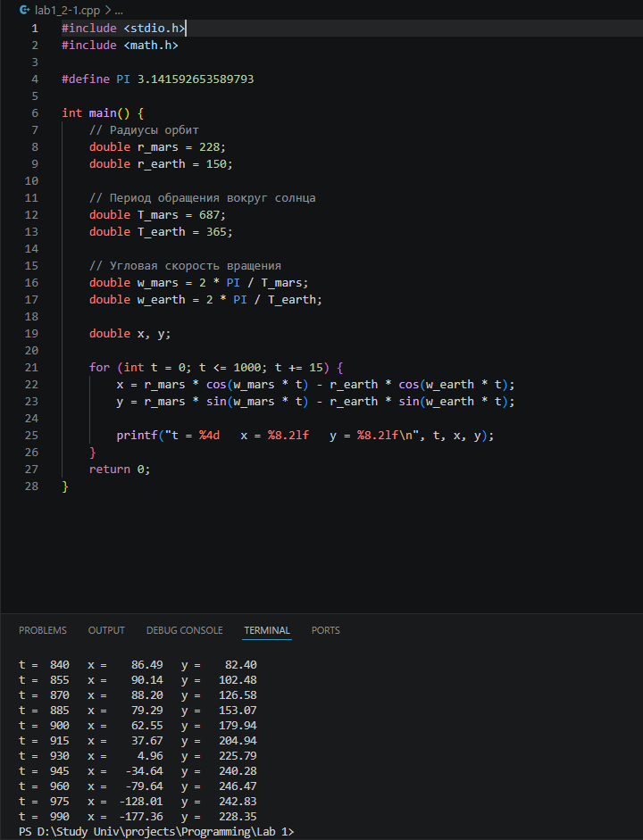

### Задача 2.2 - Вычислить определённый интеграл от заданной функции методом трапеций

#### Постановка задачи

Вычислить определённый интеграл от заданной функции методом трапеций:

$$
\int_{a}^{b} f(x) \, dx = \int_{a}^{b} e^{x+2} \, dx
$$

#### Математическая модель

$$
S = h * \left(\frac{\left(e^{a+2}\right) + \left(e^{b+2}\right)}{2} + \sum_{i = 1}^{n-1} e^{(a + i h) + 2}\right)
$$

При нижнем пределе интегрирования $a = 1$ и верхнем пределе $b = 5$ получаем:

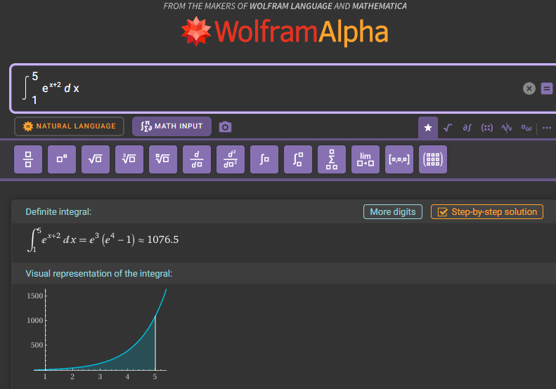

#### Список идентификаторов

| Имя переменной | Тип данных |   Описание                    |
|----------------|------------|-------------------------------|
| h              |   double   | шаг интегрирования            |
| integral       |   double   | сумма интеграла               |
| n              |    int     | количество разбиений          |
| a              |   double   | нижний предел интегрирования  |
| b              |   double   | верхний предел интегрирования |
| trapezoid_res  |   double   | высчитанный интеграл          |

#### Код программы

```c
#include <stdio.h>
#include <math.h>

double fun(double x) {
    return exp(x + 2);
}

double trapezoid(double a, double b, int n) {
    double h = (b - a) / n;
    double integral = 0.5 * (fun(a) + fun(b));

    for (double i = a + h; i < b; i += h) {
        integral += fun(i);
    }

    integral *= h;
    return integral;
}

int main() {
    double a, b;
    int n;

    printf("Enter the lower limit of integration (a): ");
    scanf("%lf", &a);
    printf("Enter the upper limit of integration (b): ");
    scanf("%lf", &b);
    printf("Enter the number of splits (n): ");
    scanf("%d", &n);

    double trapezoid_res = trapezoid(a, b, n);
    
    printf("The approximate value of the integral by the trapezoid method from %.2f to %.2f: %.6f\n", a, b, trapezoid_res);
    return 0;
}
```

#### Результат работы

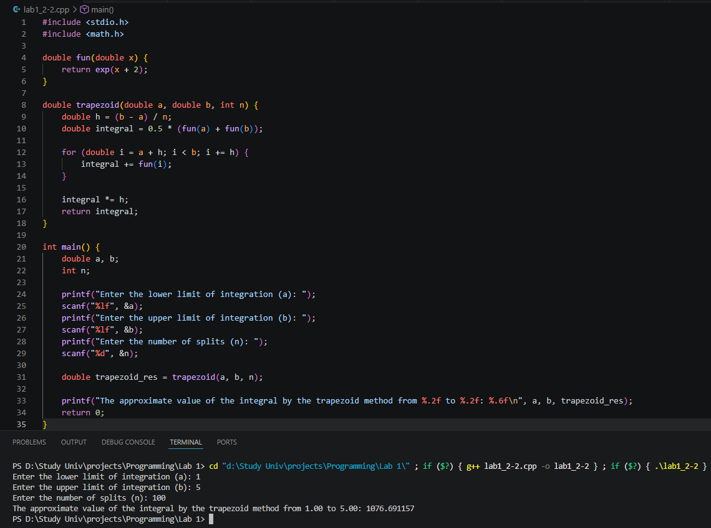

### Задача 2.3 Вывести последовательность чисел Падована, не превышающую число $m$

#### Постановка задачи

Организовать и распечатать последовательность чисел Падована, не превосходящих число $m$, введенное с клавиатуры. Числа Падована представлены следующим рядом: 1, 1, 1, 2, 2, 3, 4, 5, 7, 9, 12, 16, 21, 28, 37, 49, 65, 86, 114, 151, 200, 265, ... Использовать конструкцию for и простые варианты условной конструкции if else. Для этих чисел заданы формулы:

$$
P(0) = P(1) = P(2) = 1\\
P(n) = P(n - 2) + P(n - 3)
$$

#### Математическая модель

$$
P(0) = P(1) = P(2) = 1\\
P(n) = P(n - 2) + P(n - 3)
$$

#### Список идентификаторов

| Имя переменной | Тип данных |   Описание                         |
|----------------|------------|------------------------------------|
| p0             |    int     | значение P(n-3)                    |
| p1             |    int     | значение P(n-2)                    |
| p2             |    int     | значение P(n-1)                    |
| pn             |    int     | текущее значение P(n)              |
| m              |    int     | верхняя граница последовательности |

#### Код программы

```c
#include <stdio.h>


int main() {
    int p0 = 1;
    int p1 = 1;
    int p2 = 1;
    int pn;
    int m;

    printf("Enter a 'm' number: ");
    scanf("%d", &m);
    if (m > 0){
        printf("The Padovan sequence: %d %d %d ", p0, p1, p2);
    } else {
        printf("Enter a number greater than zero");
        return 0;
    }
    

    for (int i = 3; ; i++) {
        pn = p1 + p0;

        if (pn <= m) {
            printf("%d ", pn);

            p0 = p1;
            p1 = p2;
            p2 = pn;
        }
        else {
            break;
        }
    }

    return 0;
}
```

#### Результат работы

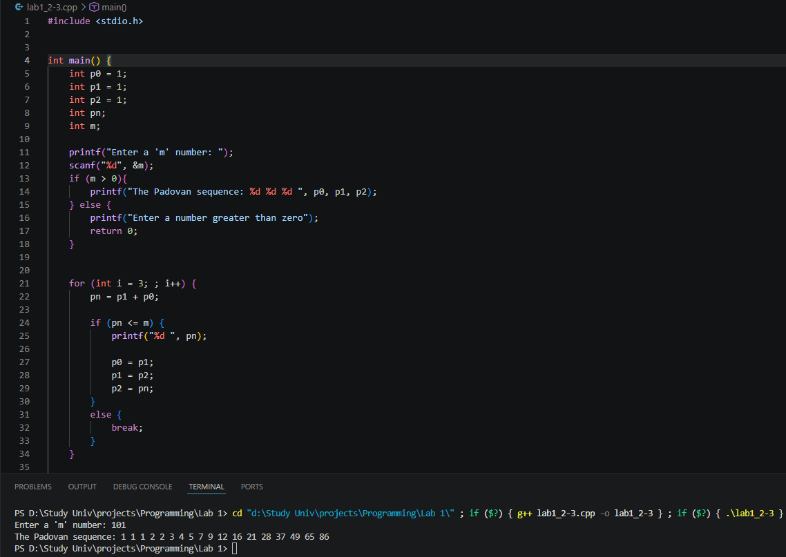

### Задача 2.4 - Вычислить сумму цифр введённого числа

#### Постановка задачи

С клавиатуры вводится трёхзначное число, считается сумма его цифр. Если сумма цифр числа больше 10, то вводится следующее трёхзначное число,если сумма меньше либо равна 10 — программа завершается.

#### Математическая модель

$$
n = 100a + 10b + c
$$

где:
- $a$ — сотни  
- $b$ — десятки  
- $c$ — единицы  

Сумма цифр числа:

$$
S = a + b + c
$$

#### Список идентификаторов

| Имя переменной | Тип данных |   Описание                         |
|----------------|------------|------------------------------------|
| n              |    int     | пользовательское число             |
| sum            |    int     | сумма цифр числа                   |
| check          |  boolean   | флаг для приостановки работы цикла |

#### Код программы

```c
#include <stdio.h>


int main() {
    int n;
    int sum = 0;
    
    bool check = true;

    while(check) {
        sum = 0;
        printf("Enter a 'n' number: ");
        scanf("%d", &n);
        while (n != 0) {
            sum += n % 10;
            n = n / 10;
        }
        if(sum <= 10){
            check = false;
            printf("The amount is less than 10. Program terminated.");
        }
        else {
            printf("The amount is more than 10\n");
        }
    }

    return 0;
}
```

#### Результат работы

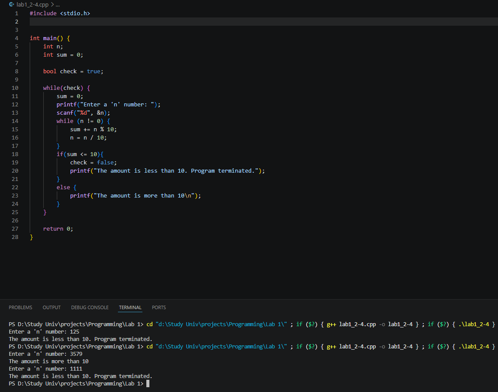

## Комплект 3: Основы работы со статическими массивами

### Задача 3.1 - Возвести в квадрат все элементы массива

#### Постановка задачи

Для некоторого числового вектора X, введённого с клавиатуры, вычислить значения вектора $Y = X · X (y_i = x_i · x_i—поэлементно)$.

#### Математическая модель

$y_i = x_i · x_i$

#### Список идентификаторов

| Имя переменной | Тип данных |   Описание                    |
|----------------|------------|-------------------------------|
| ARRAY_SIZE     | int(const) | размер массива (константа)    |
| array          |    int[]   | массив чисел                  |
| array_size     |    int     | размер массива (динамический) |
| ptr            |    int*    | указатель на 1 элемент массива|

#### Код программы

```c
#include <stdio.h>
#include <stdlib.h>

#define ARRAY_SIZE 10

int main() {
    int array[ARRAY_SIZE];

    for (int i = 0; i < ARRAY_SIZE; i++) {
        printf("Enter %d number: ", i + 1);
        scanf("%d", &array[i]);
    }

    printf("New static vector:\n");
    for(int i = 0; i < ARRAY_SIZE; i++) {
        array[i] *= array[i];
        printf("%d ", array[i]);
    }

    // Dynamic array
    int array_size;
    printf("\nEnter a size of array: ");
    scanf("%d", &array_size);

    int *ptr = (int*) malloc(array_size * sizeof(int));

    if (ptr == NULL) {
        printf("Memory allocation failed");
        return 1;
    }
    
    for (int i = 0; i < array_size; i++) {
        printf("Enter %d number: ", i + 1);
        scanf("%d", &ptr[i]);
    }

    printf("New dynamic vector:\n");
    for(int i = 0; i < array_size; i++) {
        ptr[i] *= ptr[i];
        printf("%d ", ptr[i]);
    }

    free(ptr);
    return 0;
}
```

#### Результат работы

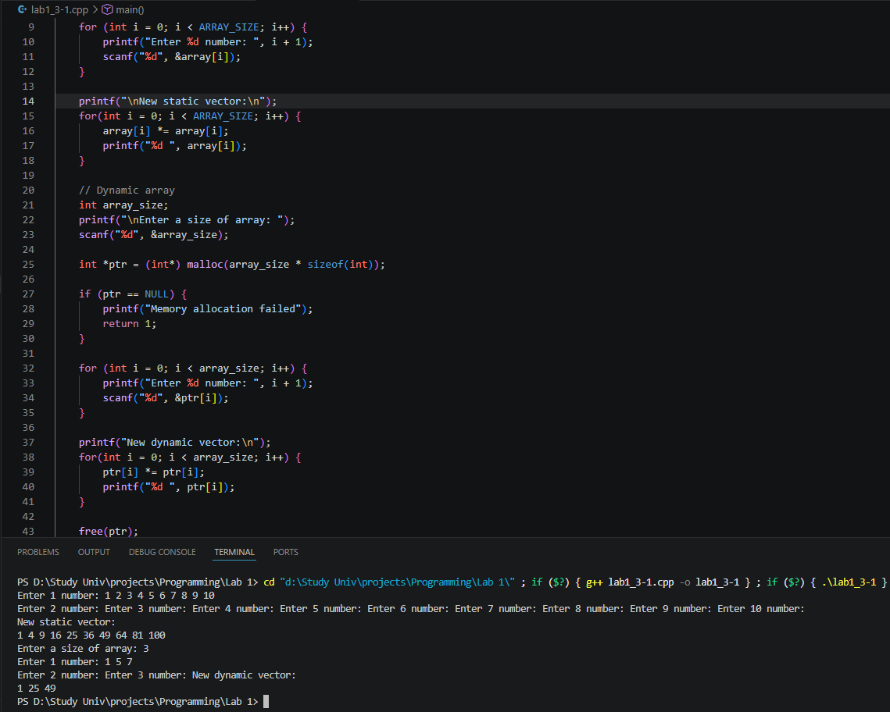

### Задача 3.2 - Развернуть массив

#### Постановка задачи

Для некоторого числового массива X, введённого с клавиатуры поэлементно, изменить порядок элементов на обратный и распечатать результат на экране.

#### Математическая модель

Выполняется перестановка элементов массива:

$$
x_i \leftrightarrow x_{n-1-i}, \quad i = 0, 1, \dots, \frac{n-1}{2}
$$

#### Список идентификаторов

| Имя переменной | Тип данных |   Описание                               |
|----------------|------------|------------------------------------------|
| ARRAY_SIZE     | int(const) | размер массива (константа)               |
| array          |    int[]   | массив чисел                             |
| temp           |    int     | временное хранение переставляемого числа |
| array_size     |    int     | размер массива (динамический)            |
| ptr            |    int*    | указатель на 1 элемент массива           |

#### Код программы

```c
#include <stdio.h>
#include <stdlib.h>

#define ARRAY_SIZE 10

int main() {
    int array[ARRAY_SIZE];

    for (int i = 0; i < ARRAY_SIZE; i++) {
        printf("Enter %d number: ", i + 1);
        scanf("%d", &array[i]);
    }

    
    for(int i = 0; i < ARRAY_SIZE / 2; i++) {
        int temp = array[i];
        array[i] = array[ARRAY_SIZE - 1 - i];
        array[ARRAY_SIZE - 1 - i] = temp;
    }
    
    printf("Reversed array: ");
    for (int i = 0; i < ARRAY_SIZE; i++) {
        printf("%d ", array[i]);
    }


    // Dynamic array
    int array_size;
    printf("\nEnter a size of array: ");
    scanf("%d", &array_size);

    int *ptr = (int*) malloc(array_size * sizeof(int));

    if (ptr == NULL) {
        printf("Memory allocation failed");
        return 1;
    }
    
    for (int i = 0; i < array_size; i++) {
        printf("Enter %d number: ", i + 1);
        scanf("%d", &ptr[i]);
    }

    for(int i = 0; i < array_size / 2; i++) {
        int temp = ptr[i];
        ptr[i] = ptr[array_size - 1 - i];
        ptr[array_size - 1 - i] = temp;
    }

    printf("Reversed array: ");
    for (int i = 0; i < array_size; i++) {
        printf("%d ", ptr[i]);
    }

    free(ptr);
    return 0;
}
```

#### Результат работы

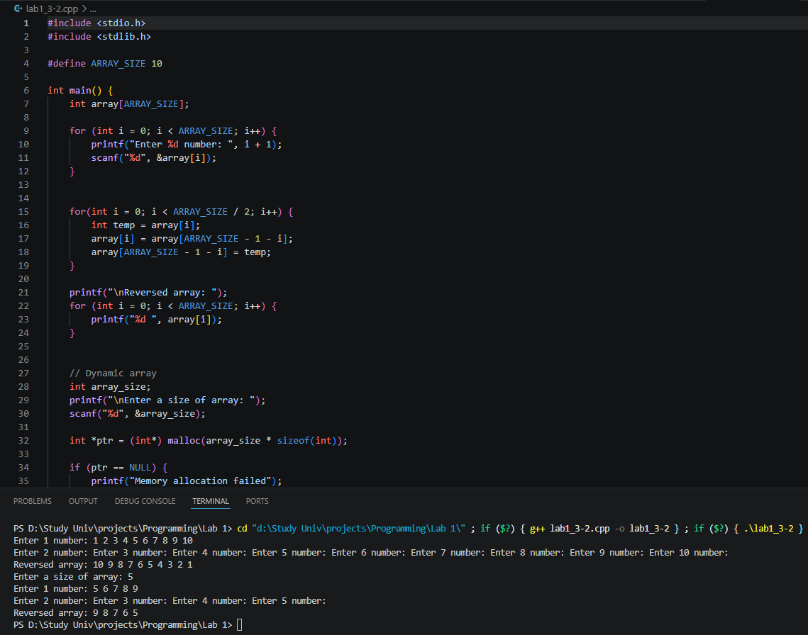

### Задача 3.3 - Транспонировать матрицу

#### Постановка задачи

Транспонировать матрицу:

$$
A = 
\begin{bmatrix}
1 & 2 & 3\\
4 & 5 & 6\\
7 & 8 & 9
\end{bmatrix}
$$

#### Математическая модель

$$
a_{ij}^T = a_{ji}
$$

#### Список идентификаторов

| Имя переменной | Тип данных |   Описание                                     |
|----------------|------------|------------------------------------------------|
| ROWS           | int(const) | количество строк матрицы (константа)           |
| COLS           | int(const) | количество столбцов матрицы (константа)        |
| matrix         |   int[][]  | двумерный массив (матрица)                     |
| t_matrix       |   int[][]  | транспонированная матрица                      |
| rows           |    int     | количество строк матрицы (динамический)        |
| cols           |    int     | количество столбцов матрицы (динамический)     |
| dyn_matrix     |    int**   | указатель на массив строк матрицы              |
| t_dyn_matrix   |    int**   | указатель на 1 строку транспонированной матрицы|

#### Код программы

```c
#include <stdio.h>
#include <stdlib.h>

#define ROWS 4
#define COLS 4

int main() {

    // Static matrix
    int matrix[ROWS][COLS];

    printf("Enter matrix:\n");

    for (int i = 0; i < ROWS; i++) {
        for (int j = 0; j < COLS; j++) {
            printf("A[%d][%d] = ", i, j);
            scanf("%d", &matrix[i][j]);
        }
    }

    int t_matrix[COLS][ROWS];
    for (int i = 0; i < ROWS; i++) {
        for (int j = 0; j < COLS; j++) {
            t_matrix[j][i] = matrix[i][j];
        }
    }

    printf("Transp matrix:\n");
    for (int i = 0; i < COLS; i++) {
        for (int j = 0; j < ROWS; j++) {
            printf("%3d  ", t_matrix[i][j]);
        }
        printf("\n");
    }


    // Dynamic matrix
    int rows, cols;
    printf("\nEnter count rows of array: ");
    scanf("%d", &rows);

    printf("Enter count cols of array: ");
    scanf("%d", &cols);

    int **dyn_matrix = (int**) malloc(rows * sizeof(int*));

    for (int i = 0; i < rows; i++) {
        dyn_matrix[i] = (int*) malloc(cols * sizeof(int));
    }
    
    printf("Enter matrix:\n");

    for (int i = 0; i < rows; i++) {
        for (int j = 0; j < cols; j++) {
            printf("A[%d][%d] = ", i, j);
            scanf("%d", &dyn_matrix[i][j]);
        }
    }

    int **t_dyn_matrix = (int**) malloc(cols * sizeof(int*));

    for (int i = 0; i < cols; i++) {
        t_dyn_matrix[i] = (int*) malloc(rows * sizeof(int));
    }

    for (int i = 0; i < rows; i++) {
        for (int j = 0; j < cols; j++) {
            t_dyn_matrix[j][i] = dyn_matrix[i][j];
        }
    }
    
    printf("Transp matrix:\n");
    for (int i = 0; i < cols; i++) {
        for (int j = 0; j < rows; j++) {
            printf("%3d  ", t_dyn_matrix[i][j]);
        }
        printf("\n");
    }

    for (int i = 0; i < rows; i++) {
        free(dyn_matrix[i]);
    }
    free(dyn_matrix);

    for (int i = 0; i < cols; i++) {
        free(t_dyn_matrix[i]);
    }
    free(t_dyn_matrix);
    return 0;
}
```

#### Результат работы

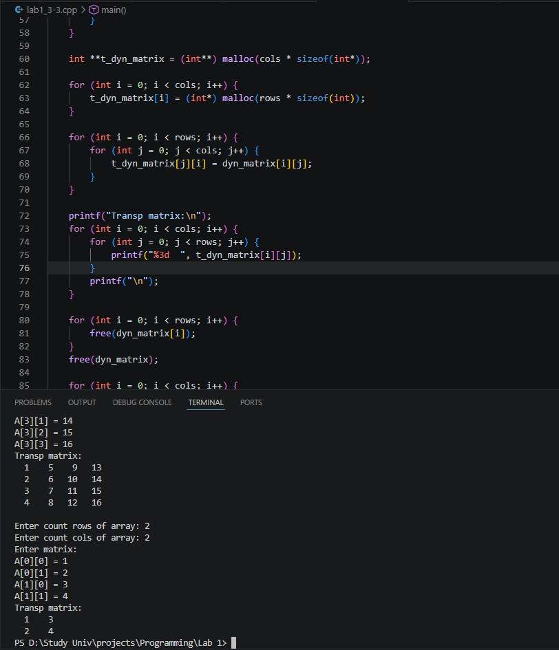

### Задача 3.4 - Заменить первый элемент строки матрицы на среднее арифметическое строки

#### Постановка задачи

Преобразовать исходную матрицу так, чтобы первый элемент каждой строки был заменён средним арифметическим элементов этой строки.

#### Математическая модель

$$
a_{i1} = \frac{\sum_{j=0}^{cols} a_{ij}}{cols}
$$

#### Список идентификаторов

| Имя переменной | Тип данных |   Описание                                     |
|----------------|------------|------------------------------------------------|
| ROWS           | int(const) | количество строк матрицы (константа)           |
| COLS           | int(const) | количество столбцов матрицы (константа)        |
| matrix         | double[][] | двумерный массив (матрица)                     |
| avg            |   double   | среднее арифметическое строки                  |

#### Код программы

```c
#include <stdio.h>
#include <stdlib.h>

#define ROWS 4
#define COLS 4

int main() {

    // Static matrix
    double matrix[ROWS][COLS];

    printf("Enter matrix:\n");

    for (int i = 0; i < ROWS; i++) {
        for (int j = 0; j < COLS; j++) {
            printf("A[%d][%d] = ", i, j);
            scanf("%lf", &matrix[i][j]);
        }
    }

    for (int i = 0; i < ROWS; i++) {
        double avg = 0;
        for (int j = 0; j < COLS; j++) {
            avg += matrix[i][j];
        }
        avg /= COLS;
        matrix[i][0] = avg;
    }

    for (int i = 0; i < ROWS; i++) {
        for (int j = 0; j < COLS; j++) {
            printf("%5.1lf  ", matrix[i][j]);
        }
        printf("\n");
    }

    return 0;
}
```

#### Результат работы

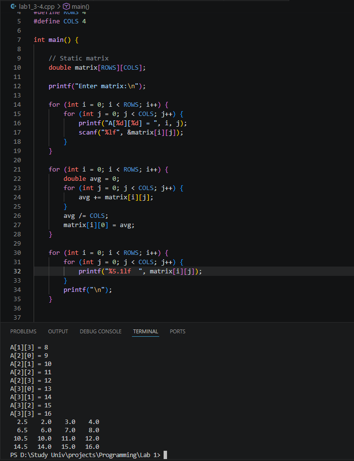

### Задача 3.5 - Реализовать алгоритм сортировки вставками

#### Постановка задачи

Реализовать самостоятельно алгоритм сортировки вставками (без создания своих функций, внутри функции main).

#### Математическая модель

На каждом шаге алгоритма рассматривается элемент $a_i$, где:

$$
i = 1, 2, \dots, n-1
$$

Элемент $a_i$ вставляется в упорядоченную часть массива

$$
(a_0, a_1, \dots, a_{i-1})
$$
таким образом, чтобы после вставки выполнялось условие:

$$
a_0 \le a_1 \le a_2 \le \dots \le a_i
$$

Если соседние элементы расположены в неверном порядке, то выполняется их перестановка:

$$
a_{j-1} > a_j \;\Rightarrow\; a_{j-1} \leftrightarrow a_j
$$

где:

$$
j = i, i-1, \dots, 1
$$

В результате после завершения сортировки массив удовлетворяет условию:

$$
a_0 \le a_1 \le a_2 \le \dots \le a_{n-1}
$$

#### Список идентификаторов

| Имя переменной | Тип данных |   Описание                               |
|----------------|------------|------------------------------------------|
| ARRAY_SIZE     | int(const) | размер массива (константа)               |
| array          |    int[]   | массив чисел                             |
| temp           |    int     | временное хранение переставляемого числа |

#### Код программы

```c
#include <stdio.h>
#include <stdlib.h>

#define ARRAY_SIZE 10

int main() {
    int array[ARRAY_SIZE];

    for (int i = 0; i < ARRAY_SIZE; i++) {
        printf("Enter %d number: ", i + 1);
        scanf("%d", &array[i]);
    }

    for (int i = 1; i < ARRAY_SIZE; i++) {
        for (int j = i; j > 0 && array[j - 1] > array[j]; j--) {
            int temp = array[j];
            array[j] = array[j - 1];
            array[j - 1] = temp;
        }
    }

    printf("Sorted array: ");
    for (int i = 0; i < ARRAY_SIZE; i++) {
        printf("%d ", array[i]);
    }

    return 0;
}
```
#### Результат работы

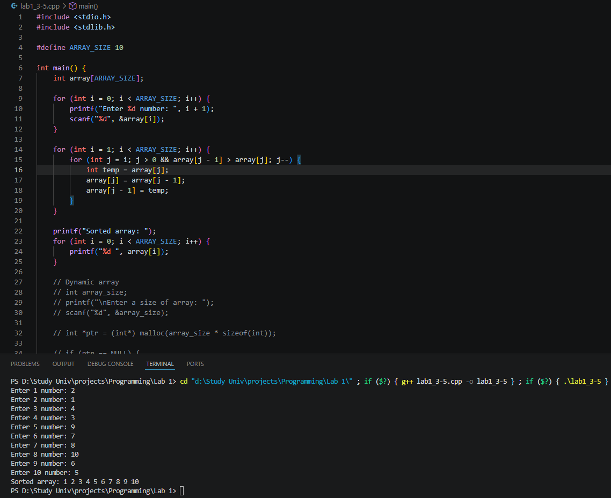

## Информация о студенте

Хубларян Эдуард, 1 курс, ИВТ, 1 гр. 1 п.гр
