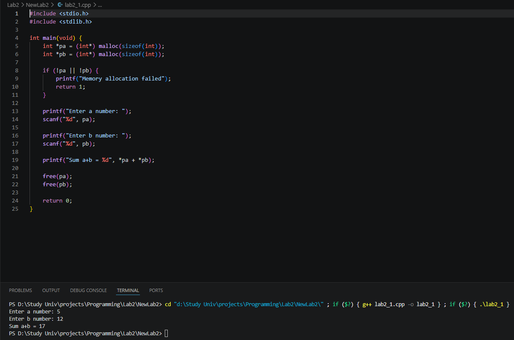
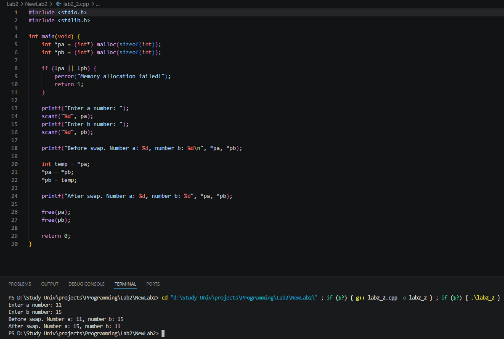
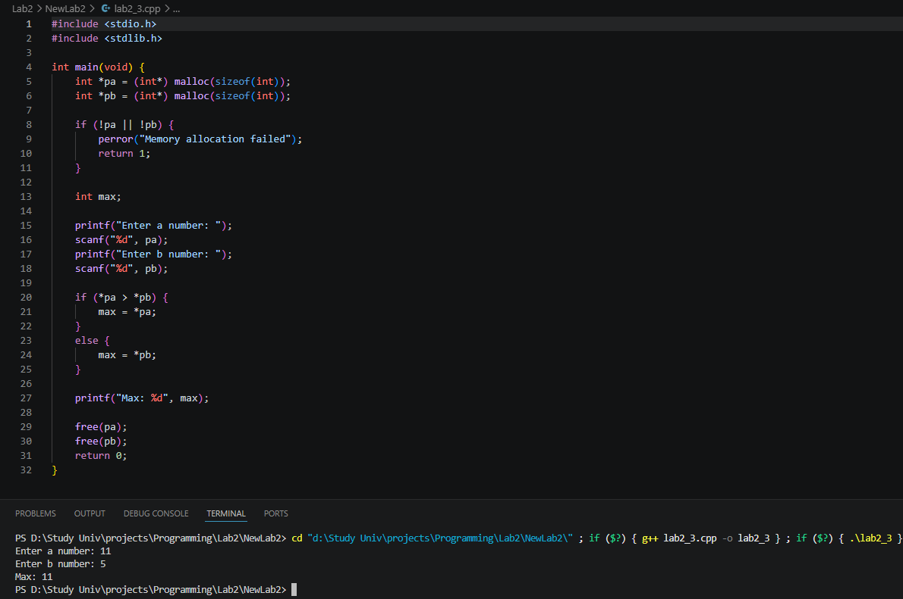
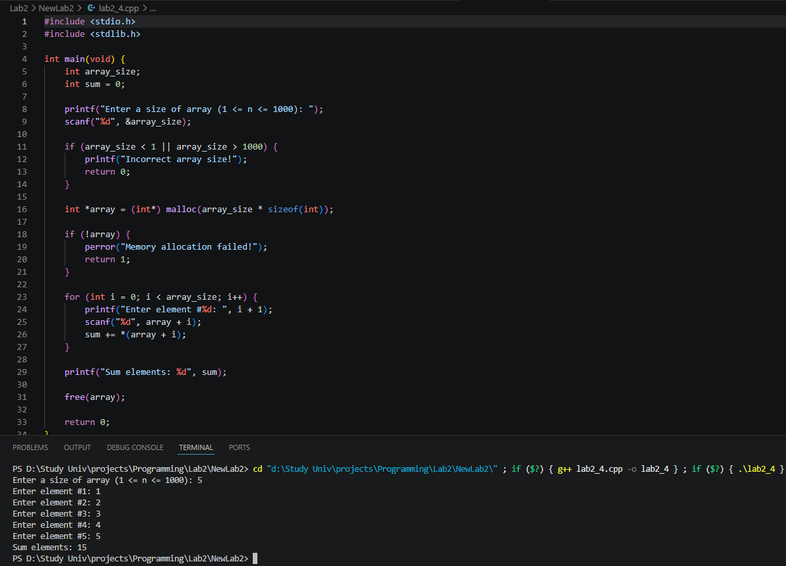
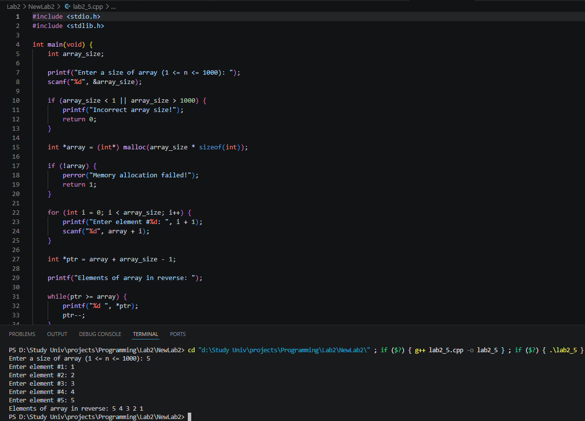
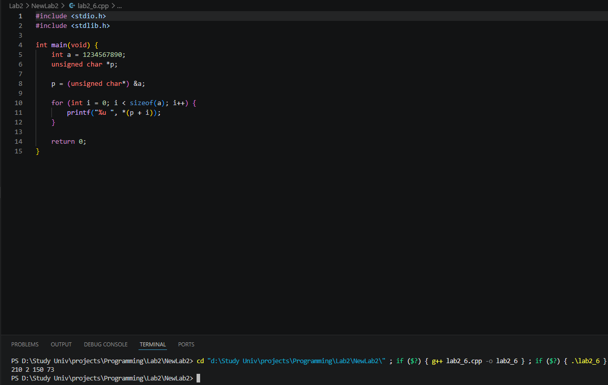
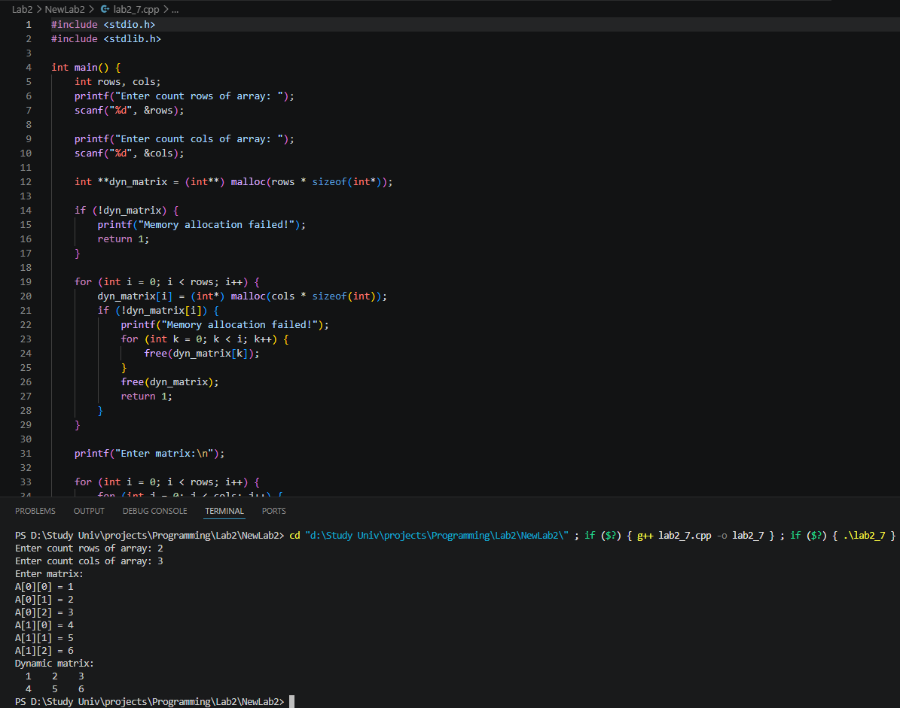

# Лабораторная работа №2. Указатели и динамическая память


### Задача 1 - Сложение через указатели

#### Постановка задачи

Цель: получить значение переменных через указатели.
Вход: два целых числа a, b.
Выход: сумма чисел.
Требование: складывать значения через указатели int *pa, int
*pb.
Пример: Ввод: 8 9
Вывод: 17

#### Математическая модель

Пусть заданы два числа: a и b.

Требуется вычислить их сумму:

S = a + b

#### Список идентификаторов

| Имя переменной | Тип данных |   Описание                |
|----------------|------------|---------------------------|
| pa             |    int*    | указатель на первое число |
| pb             |    int*    | указатель на второе число |

#### Код программы

```c
#include <stdio.h>
#include <stdlib.h>

int main(void) {
    int *pa = (int*) malloc(sizeof(int));
    int *pb = (int*) malloc(sizeof(int));

    if (!pa || !pb) {
        printf("Memory allocation failed");
        return 1;
    }

    printf("Enter a number: ");
    scanf("%d", pa);

    printf("Enter b number: ");
    scanf("%d", pb);

    printf("Sum a+b = %d", *pa + *pb);

    free(pa);
    free(pb);

    return 0;
}
```

#### Результат работы программы



### Задача 2 - Обмен двух чисел

#### Постановка задачи

Цель: изменить данные по адресу (swap).
Вход: два целых числа a, b.
Выход: сначала исходные, затем обменённые значения.
Требование: обмен выполнять через указатели.
Пример: Ввод: 3 7
Вывод: 3 7 и затем 7 3

#### Математическая модель

Пусть заданы два числа: a и b.

Требуется поменять их местами:

temp = a
a = b
b = temp

#### Список идентификаторов

| Имя переменной | Тип данных |   Описание                 |
|----------------|------------|----------------------------|
| pa             |    int*    | указатель на первое число  |
| pb             |    int*    | указатель на второе число  |
| temp           |    int     | переменная для перестановки|

#### Код программы

```c
#include <stdio.h>
#include <stdlib.h>

int main(void) {
    int *pa = (int*) malloc(sizeof(int));
    int *pb = (int*) malloc(sizeof(int));

    if (!pa || !pb) {
        perror("Memory allocation failed!");
        return 1;
    }

    printf("Enter a number: ");
    scanf("%d", pa);
    printf("Enter b number: ");
    scanf("%d", pb);

    printf("Before swap. Number a: %d, number b: %d\n", *pa, *pb);
    
    int temp = *pa;
    *pa = *pb;
    *pb = temp;

    printf("After swap. Number a: %d, number b: %d", *pa, *pb);

    free(pa);
    free(pb);
    
    return 0;
}
```

#### Результат работы программы



### Задача 3 - Максимум через указатели

#### Постановка задачи

Цель: условие с обращением по указателю.
Вход: два целых числа.
Выход: максимальное из них.
Требование: сравнивать значения через указатели.
Пример: Ввод: 11 4
Вывод: 11

#### Математическая модель

Пусть заданы два числа: a и b.
Если a > b, то выводим a.
Иначе b.

#### Список идентификаторов

| Имя переменной | Тип данных |   Описание                 |
|----------------|------------|----------------------------|
| pa             |    int*    | указатель на первое число  |
| pb             |    int*    | указатель на второе число  |
| max            |    int     | максимальное число         |

#### Код программы

```c
#include <stdio.h>
#include <stdlib.h>

int main(void) {
    int *pa = (int*) malloc(sizeof(int));
    int *pb = (int*) malloc(sizeof(int));

    if (!pa || !pb) {
        perror("Memory allocation failed");
        return 1;
    }

    int max;

    printf("Enter a number: ");
    scanf("%d", pa);
    printf("Enter b number: ");
    scanf("%d", pb);

    if (*pa > *pb) {
        max = *pa;
    }
    else {
        max = *pb;
    }

    printf("Max: %d", max);

    free(pa);
    free(pb);
    return 0;
}
```

#### Результат работы программы



### Задача 4 - Динамический массив и сумма

#### Постановка задачи

Цель: выделить память под массив и пройти его указателем.
Вход: число n, затем n целых чисел.
Выход: сумма всех элементов.
Ограничения: 1 <= n <= 1000.
Требование: обход элементов через арифметику указателей.
Пример: Ввод: 4 и 2 3 4 5
Вывод: 14

#### Математическая модель

Пусть задан массив, введённый пользователем.

Совершается обход массива и высчитывается сумма его элементов:

Sum = sum + *(array + i)

#### Список идентификаторов

| Имя переменной | Тип данных |   Описание                 |
|----------------|------------|----------------------------|
| array_size     |    int     | кол-во элементов массива   |
| array          |    int*    | указатель на начало массива|
| sum            |    int     | сумма элементов массива    |

#### Код программы

```c
#include <stdio.h>
#include <stdlib.h>

int main(void) {
    int array_size;
    int sum = 0;

    printf("Enter a size of array (1 <= n <= 1000): ");
    scanf("%d", &array_size);

    if (array_size < 1 || array_size > 1000) {
        printf("Incorrect array size!");
        return 1;
    }

    int *array = (int*) malloc(array_size * sizeof(int));

    if (!array) {
        perror("Memory allocation failed!");
        return 1;
    }

    for (int i = 0; i < array_size; i++) {
        printf("Enter element #%d: ", i + 1);
        scanf("%d", array + i);
        sum += *(array + i);
    }

    printf("Sum elements: %d", sum);

    free(array);
    
    return 0;
}
```

#### Результат работы программы



### Задача 5 - Обратный вывод динамического массива

#### Постановка задачи

Цель: декремент указателя.
Вход: число n, затем n целых чисел.
Выход: элементы в обратном порядке.
Ограничения: 1 <= n <= 1000.
Требование: использовать указатель и операцию--.
Пример: Ввод: 3 и 10 20 30
Вывод: 30 20 10

#### Математическая модель

Пусть задан массив элементов, введённый пользователем.
Необходимо вывести его в обратном порядке.

Задаётся указатель на последний элемент массива и операцией декремента указателя (ptr--), указатель перемещается к началу массива.

#### Список идентификаторов

| Имя переменной | Тип данных |   Описание                  |
|----------------|------------|-----------------------------|
| array_size     |    int     | кол-во элементов массива    |
| array          |    int*    | указатель на начало массива |
| ptr            |    int*    | указатель на элемент массива|

#### Код программы

```c
#include <stdio.h>
#include <stdlib.h>

int main(void) {
    int array_size;
    
    printf("Enter a size of array (1 <= n <= 1000): ");
    scanf("%d", &array_size);

    if (array_size < 1 || array_size > 1000) {
        printf("Incorrect array size!");
        return 1;
    }

    int *array = (int*) malloc(array_size * sizeof(int));

    if (!array) {
        perror("Memory allocation failed!");
        return 1;
    }

    for (int i = 0; i < array_size; i++) {
        printf("Enter element #%d: ", i + 1);
        scanf("%d", array + i);
    }

    int *ptr = array + array_size - 1;

    printf("Elements of array in reverse: ");
    
    while(ptr >= array) {
        printf("%d ", *ptr);
        ptr--;
    }

    free(array);

    return 0;
}
```

#### Результат работы



### Задача 6 - Побайтовый вывод int

#### Постановка задачи

Цель: понять, как данные хранятся в памяти.
Дано: int a = 1234567890;
Выход: значения байтов переменной (в десятичном виде).
Требование: использовать указатель unsigned char *.

#### Математическая модель

Передвигаясь по байтам в памяти выводим значение текущего байта

#### Список идентификаторов

| Имя переменной |  Тип данных  |   Описание                 |
|----------------|--------------|----------------------------|
| a              |     int      | заданное число             |
| p              |unsigned char*| указатель на числов памяти |

#### Код программы

```c
#include <stdio.h>
#include <stdlib.h>

int main(void) {
    int a = 1234567890;
    unsigned char *p;

    p = (unsigned char*) &a;

    for (int i = 0; i < sizeof(a); i++) {
        printf("%u ", *(p + i));
    }

    return 0;
}
```

#### Результат работы



### Задача 7 - Динамическая матрица

#### Постановка задачи

Цель: базовая работа с двумерным динамическим массивом.
Вход: 6 целых чисел для матрицы 2 x 3.
Выход: та же матрица построчно.
Требование: выделить память как массив указателей на строки
и корректно освободить.
Пример: Ввод: 1 2 3 4 5 6
Вывод:
123
456

#### Математическая модель

Входные данные:
Шесть целых чисел $a_1, a_2, a_3, a_4, a_5, a_6 ∈ Z$

Эти числа интерпретируются как элементы матрицы A 2×3, заполняемой по строкам.

Выходные данные:
Матрица A, выведенная построчно. Каждая строка – три записанных подряд числа (без пробелов). Строки разделяются символом перевода строки.

#### Список идентификаторов

| Имя переменной | Тип данных |   Описание                                     |
|----------------|------------|------------------------------------------------|
| rows           |    int     | количество строк матрицы (динамический)        |
| cols           |    int     | количество столбцов матрицы (динамический)     |
| dyn_matrix     |    int**   | указатель на массив строк матрицы              |

#### Код программы

```c
#include <stdio.h>
#include <stdlib.h>

int main() {
    int rows, cols;
    printf("Enter count rows of array: ");
    scanf("%d", &rows);

    printf("Enter count cols of array: ");
    scanf("%d", &cols);

    int **dyn_matrix = (int**) malloc(rows * sizeof(int*));

    if (!dyn_matrix) {
        printf("Memory allocation failed!");
        return 1;
    }

    for (int i = 0; i < rows; i++) {
        dyn_matrix[i] = (int*) malloc(cols * sizeof(int));
        if (!dyn_matrix[i]) {
            printf("Memory allocation failed!");
            for (int k = 0; k < i; k++) {
                free(dyn_matrix[k]);
            }
            free(dyn_matrix);
            return 1;
        }
    }
    
    printf("Enter matrix:\n");

    for (int i = 0; i < rows; i++) {
        for (int j = 0; j < cols; j++) {
            printf("A[%d][%d] = ", i, j);
            scanf("%d", &dyn_matrix[i][j]);
        }
    }

    
    printf("Dynamic matrix:\n");
    for (int i = 0; i < rows; i++) {
        for (int j = 0; j < cols; j++) {
            printf("%3d  ", dyn_matrix[i][j]);
        }
        printf("\n");
    }

    for (int i = 0; i < rows; i++) {
        free(dyn_matrix[i]);
    }
    free(dyn_matrix);

    return 0;
}
```

#### Результат работы




## Информация о студенте

Хубларян Эдуард, 1 курс, ИВТ, 1 гр. 1 п.гр
