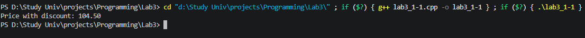
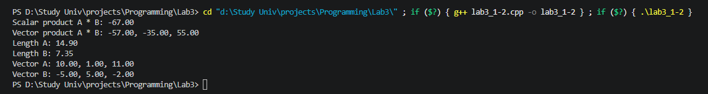
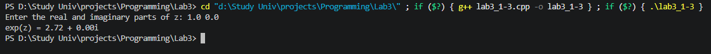
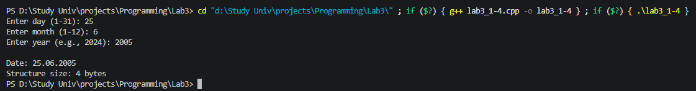
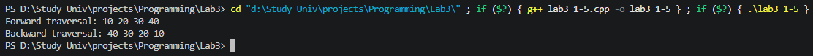
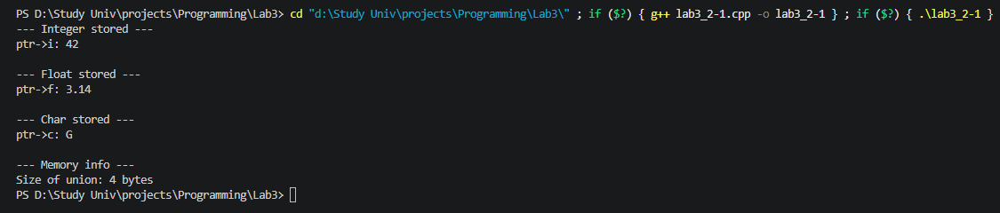
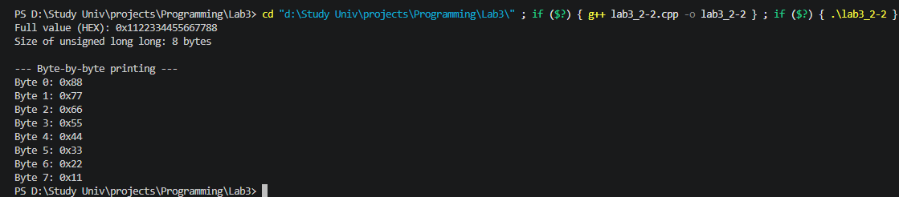
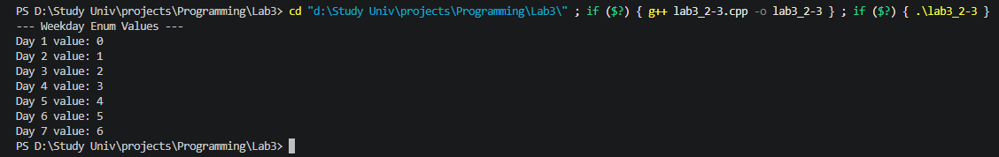
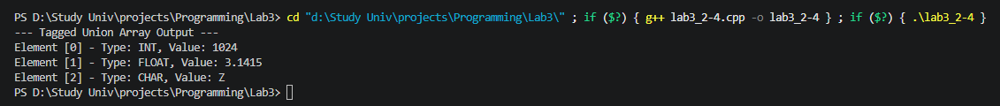

# Лабораторная работа №3. Структуры. Объединения. Перечисления


### Задача 1.1 - Указатели на функции в структурах

#### Постановка задачи

Создать некоторую структуру с указателем на некоторую функцию в качестве поля. Вызвать эту функцию через имя переменной этой структуры и поле указателя на функцию.

#### Список идентификаторов

| Имя переменной | Тип данных |   Описание                |
|-|-|-|
| price	| double	| Исходная цена товара до применения скидки |
| discount	| double	| Величина скидки в процентах |
| name	| char[]	| Название товара внутри структуры |
| priceWithDiscountPtr	| double (*)(double, double)	| Указатель на функцию, которая считает цену со скидкой |
| appleCard	| itemCard	| Структура (карточка товара) с данными о яблоке |

#### Код программы

```c
#include <stdio.h>

double priceWithDiscount(double price, double discount) {
    return price - price * (discount / 100);
}

typedef struct {
    char name[15];
    double price;
    double discount;
    double (*priceWithDiscountPtr)(double, double);
} itemCard;

int main(void) {
    itemCard appleCard = {"Apple", 110.0, 5.0, &priceWithDiscount};

    printf("Price with discount: %.2f", appleCard.priceWithDiscountPtr(appleCard.price, appleCard.discount));
    return 0;
}
```

#### Результат работы программы



### Задача 1.2 - Геометрия трехмерных векторов

#### Постановка задачи

Создать структуру для вектора в 3-х мерном пространстве. Реализовать и использховать в своей программе следующие операции над векторами:
• скалярное умножение векторов;
• векторное произведение;
• модуль вектора;
• распечатка вектора в консоли.
В структуре вектора указать имя вектора в качестве отдельного поля
этой структуры.

#### Математическая модель


  $$|\vec{a}| = \sqrt{x_1^2 + y_1^2 + z_1^2}$$


  $$\vec{a} \cdot \vec{b} = x_1 x_2 + y_1 y_2 + z_1 z_2$$


  $$\vec{a} \times \vec{b} = \begin{vmatrix} \vec{i} & \vec{j} & \vec{k} \\ x_1 & y_1 & z_1 \\ x_2 & y_2 & z_2 \end{vmatrix} = (y_1 z_2 - z_1 y_2)\vec{i} - (x_1 z_2 - z_1 x_2)\vec{j} + (x_1 y_2 - y_1 x_2)\vec{k}$$
  

#### Список идентификаторов

| Имя переменной | Тип данных |   Описание                 |
|-|-|-|
| x	| double	| Координата вектора по оси X |
| y	| double	| Координата вектора по оси Y |
| z	| double	| Координата вектора по оси Z |
| name	| char[]	| Текстовое имя (метка) вектора |
| a	| vector	| Первый трехмерный вектор для вычислений |
| b	| vector	| Второй трехмерный вектор для вычислений |
| c	| vector	| Новый вектор, полученный в результате векторного произведения |

#### Код программы

```c
#include <stdio.h>
#include <math.h>

typedef struct {
    double x;
    double y;
    double z;
    char name[10];
} vector;

void printVector(vector a) {
    printf("%.2f, %.2f, %.2f\n", a.x, a.y, a.z);
}

double scalarProduct(vector a, vector b) {
    return a.x * b.x + a.y * b.y + a.z * b.z;
}

vector vectorProduct(vector a, vector b) {
    vector c;
    c.x = a.y * b.z - a.z * b.y;
    c.y = -(a.x * b.z - a.z * b.x);
    c.z = a.x * b.y - a.y * b.x;

    return c;
}

double vectorLength(vector a) {
    return sqrt(a.x * a.x + a.y * a.y + a.z * a.z);
}

int main(void) {
    vector a = {10.0, 1.0, 11.0, "A"};
    vector b = {-5.0, 5.0, -2.0, "B"};

    printf("Scalar product %s * %s: %.2f\n", a.name, b.name, scalarProduct(a, b));
    printf("Vector product %s * %s: ", a.name, b.name);
    printVector(vectorProduct(a, b));
    printf("Length %s: %.2f\nLength %s: %.2f\n", a.name, vectorLength(a), b.name, vectorLength(b));
    printf("Vector %s: ", a.name);
    printVector(a);
    printf("Vector %s: ", b.name);
    printVector(b);
    return 0;
}
```

#### Результат работы программы



### Задача 1.3 - Комплексная экспонента

#### Постановка задачи

 Вычислить, используя структуру комплексного числа, комплексную экспоненту $exp(z)$ некоторого $z ∈ C$

#### Математическая модель

Комплексное число задаётся как $z = x + iy$, где $x, y \in \mathbb{R}$, а $i = \sqrt{-1}$.

  $$\exp(z) = \sum_{n=0}^{\infty} \frac{z^n}{n!} = 1 + z + \frac{z^2}{2!} + \frac{z^3}{3!} + \dots + \frac{z^n}{n!}$$


#### Список идентификаторов

| Имя переменной | Тип данных |   Описание                 |
|-|-|-|
| re	| double	| Вещественная часть комплексного числа |
| im	| double	| Мнимая часть комплексного числа |
| a	| complex	| Первый операнд для выполнения арифметических операций |
| b	| complex	| Второй операнд для выполнения арифметических операций |
| res	| complex	| Результат отдельной комплексной операции (сложения, умножения, деления) |
| n	| double	| Вещественный делитель (номер текущего члена ряда) |
| z	| complex	| Исходное комплексное число, введённое пользователем |
| sum	| complex	| Накопленная сумма членов ряда Тейлора |
| term	| complex	| Значение текущего слагаемого в ряду Тейлора |
| result	| complex	| Итоговое вычисленное значение экспоненты |

#### Код программы

```c
#include <stdio.h>
#include <math.h>

typedef struct {
    double re;
    double im;
} complex;

// Сложение комплексных чисел
complex complex_add(complex a, complex b) {
    complex res;
    res.re = a.re + b.re;
    res.im = a.im + b.im;
    return res;
}

// Умножение комплексных чисел
complex complex_mul(complex a, complex b) {
    complex res;
    res.re = a.re * b.re - a.im * b.im;
    res.im = a.re * b.im + a.im * b.re;
    return res;
}

// Деление комплексного числа на вещественный скаляр
complex complex_div_scalar(complex a, double n) {
    complex res;
    res.re = a.re / n;
    res.im = a.im / n;
    return res;
}

// Модуль комплексного числа
double complex_abs(complex a) {
    return sqrt(a.re * a.re + a.im * a.im);
}

// Вычисление экспоненты комплексного числа через ряд Тейлора
complex complex_exp(complex z) {
    const double eps = 1e-12;   // точность
    const int max_iter = 100;   // защита от бесконечного цикла

    complex sum = {1.0, 0.0};   // начальная сумма = 1
    complex term = {1.0, 0.0};  // текущий член ряда (начинается с 1)

    for (int n = 1; n <= max_iter; ++n) {
        // term = term * z / n
        term = complex_mul(term, z);
        term = complex_div_scalar(term, (double)n);

        sum = complex_add(sum, term);

        // проверка сходимости по модулю очередного члена
        if (complex_abs(term) < eps) {
            break;
        }
    }

    return sum;
}

int main(void) {
    complex z;
    printf("Enter the real and imaginary parts of z: ");
    scanf("%lf %lf", &z.re, &z.im);

    complex result = complex_exp(z);

    printf("exp(z) = %.2lf + %.2lfi\n", result.re, result.im);

    return 0;
}
```

#### Результат работы программы



### Задача 1.4 - Календарь на битовых полях

#### Постановка задачи

Используя так называемые "битовые" поля в структуре C, создать экономную структуру в оперативной памяти для заполнения даты некоторого события, например даты рождения человека.

#### Список идентификаторов

| Имя переменной | Тип данных |   Описание                 |
|-|-|-|
| day	| unsigned int	| День месяца (выделено 5 бит) |
| month	| unsigned int	| Номер месяца (выделено 4 бита) |
| year_offset	| unsigned int	С| мещение года относительно 1970-го (выделено 8 бит) |
| d	| date	| Структура, хранящая упакованные битовые поля даты |
| tmp_day	| int	| Временное число для считывания дня с клавиатуры |
| tmp_month	| int	| Временное число для считывания месяца с клавиатуры |
| full_year	| int	| Введённый пользователем полный год (например, 2026) |

#### Код программы

```c
#include <stdio.h>

typedef struct {
    unsigned int day   : 5;
    unsigned int month : 4;
    unsigned int year_offset : 8;
} date;

int main(void) {
    date d;
    int tmp_day, tmp_month, full_year;

    printf("Enter day (1-31): ");
    scanf("%d", &tmp_day);
    d.day = tmp_day;

    printf("Enter month (1-12): ");
    scanf("%d", &tmp_month);
    d.month = tmp_month;

    printf("Enter year (e.g., 2024): ");
    scanf("%d", &full_year);
    d.year_offset = full_year - 1970;

    printf("\nDate: %02u.%02u.%04d\n", d.day, d.month, 1970 + d.year_offset);
    printf("Structure size: %zu bytes\n", sizeof(date));

    return 0;
}
```

#### Результат работы программы



### Задача 1.5 - Двунаправленный связный список

#### Постановка задачи

Реализовать в виде структур двунаправленный связный список и совершить отдельно его обход в прямом и обратном направлениях с распечаткой значений каждого элемента списка.

#### Список идентификаторов

| Имя переменной | Тип данных |   Описание                  |
|-|-|-|
| data	| int	| Информационное поле узла (хранимое целое число) |
| next	| struct Node*	| Указатель на следующий элемент двусвязного списка |
| prev	| struct Node*	| Указатель на предыдущий элемент двусвязного списка |
| head	| Node* / Node**	| Указатель на начало (голову) двусвязного списка |
| tail	| Node* / Node**	| Указатель на конец (хвост) двусвязного списка |
| value	| int	| Значение, которое необходимо добавить в новый узел |
| newNode	| Node*	| Указатель на только что созданный и выделенный в памяти узел |
| current	| Node*	| Текущий узел, обрабатываемый при прямом или обратном обходе списка |

#### Код программы

```c
#include <stdio.h>
#include <stdlib.h>

typedef struct Node {
    int data;
    struct Node* next;
    struct Node* prev;
} Node;

// Функция добавления элемента в конец списка
void append(Node** head, Node** tail, int value) {
    Node* newNode = (Node*)malloc(sizeof(Node));
    if (newNode == NULL) {
        fprintf(stderr, "Error: Memory allocation failed!\n");
        exit(1);
    }
    newNode->data = value;
    newNode->next = NULL;
    newNode->prev = NULL;

    // Если список пуст
    if (*head == NULL) {
        *head = newNode;
        *tail = newNode;
        return;
    }

    // Если в списке уже есть элементы
    (*tail)->next = newNode;
    newNode->prev = *tail;
    *tail = newNode;
}

// Прямой обход
void printForward(Node* head) {
    printf("Forward traversal: ");
    Node* current = head;
    while (current != NULL) {
        printf("%d ", current->data);
        current = current->next;
    }
    printf("\n");
}

// Обратный обход
void printBackward(Node* tail) {
    printf("Backward traversal: ");
    Node* current = tail;
    while (current != NULL) {
        printf("%d ", current->data);
        current = current->prev;
    }
    printf("\n");
}

// Очистка памяти
void freeList(Node* head) {
    Node* current = head;
    while (current != NULL) {
        Node* next = current->next;
        free(current);
        current = next;
    }
}

int main() {
    Node* head = NULL;
    Node* tail = NULL;

    append(&head, &tail, 10);
    append(&head, &tail, 20);
    append(&head, &tail, 30);
    append(&head, &tail, 40);

    printForward(head);
    printBackward(tail);

    freeList(head);

    return 0;
}
```

#### Результат работы



### Задача 2.1 - Адресация и указатели на Union

#### Постановка задачи

Напишите программу, которая использует указатель на некоторое объединение union.

#### Математическая модель

Передвигаясь по байтам в памяти выводим значение текущего байта

#### Список идентификаторов

| Имя переменной |  Тип данных  |   Описание                 |
|-|-|-|
| i	| int	| Целочисленное поле объединения, занимающее общую память |
| f	| float	| Поле с плавающей точкой объединения, занимающее ту же область памяти |
| c	| char	| Символьное поле объединения, переиспользующее ту же самую память |
| var	| Data	| Объединение (union), позволяющее хранить разные типы данных в одной ячейке |
| ptr	| Data*	| Указатель на структуру объединения для работы через оператор -> |

#### Код программы

```c
#include <stdio.h>

typedef union Data {
    int i;
    float f;
    char c;
} Data;

int main() {
    Data var;             
    Data* ptr = &var;

    ptr->i = 42;
    printf("--- Integer stored ---\n");
    printf("ptr->i: %d\n", ptr->i);
    
    ptr->f = 3.14f;
    printf("\n--- Float stored ---\n");
    printf("ptr->f: %.2f\n", ptr->f);

    ptr->c = 'G';
    printf("\n--- Char stored ---\n");
    printf("ptr->c: %c\n", ptr->c);

    printf("\n--- Memory info ---\n");
    printf("Size of union: %zu bytes\n", sizeof(Data));

    return 0;
}
```

#### Результат работы



### Задача 2.2 - Побайтовый дамп памяти

#### Постановка задачи

Напишите программу, которая использует union для побайтовой распечатки типа unsigned long.

#### Список идентификаторов

| Имя переменной | Тип данных |   Описание                                     |
|-|-|-|
| value	| unsigned long long	| Целое 64-битное число, представляющее собой полную структуру данных |
| bytes	| unsigned char[]	| Массив байтов, наложенный на ту же область памяти для побайтового доступа |
| data	| BytePrinter	| Экземпляр объединения, связывающий число и его побайтовое представление |

#### Код программы

```c
#include <stdio.h>

typedef union BytePrinter {
    unsigned long long value;
    unsigned char bytes[sizeof(unsigned long long)]; 
} BytePrinter;

int main() {
    BytePrinter data;
    
    data.value = 0x1122334455667788ULL;

    printf("Full value (HEX): 0x%llx\n", data.value);
    printf("Size of unsigned long long: %zu bytes\n\n", sizeof(unsigned long long));

    printf("--- Byte-by-byte printing ---\n");
    for (size_t i = 0; i < sizeof(unsigned long long); i++) {
        printf("Byte %zu: 0x%02x\n", i, data.bytes[i]);
    }

    return 0;
}
```

#### Результат работы



### Задача 2.3 - Индексация дней недели через Enum

#### Постановка задачи

Создайте перечислимый тип данных (enum) для семи дней недели и распечатайте на экране его значения, как целые числа.

#### Список идентификаторов

| Имя переменной | Тип данных |   Описание                                     |
|-|-|-|
| MONDAY ... SUNDAY	| enum Weekday	| Именованные константы, представляющие дни недели (от 0 до 6) |
| day	| int	| Текущий день недели, используемый в качестве индекса перечисления |

#### Код программы

```c
#include <stdio.h>

typedef enum Weekday {
    MONDAY,    
    TUESDAY,   
    WEDNESDAY,
    THURSDAY,  
    FRIDAY,   
    SATURDAY, 
    SUNDAY   
} Weekday;

int main() {
    printf("--- Weekday Enum Values ---\n");

    for (int day = MONDAY; day <= SUNDAY; day++) {
        printf("Day %d value: %d\n", day + 1, day);
    }

    return 0;
}
```

#### Результат работы



### Задача 2.4 - Размеченное объединение

#### Постановка задачи

Создайте так называемое размеченное объединение union, которое заключено в виде поля структуры struct вместе с ещё одним полем, которое является перечислением enum и служит индикатором того, что именно на текущий момент хранится в таком вложенном объединении. Создать и заполнить динамический массив таких структур с объединениями внутри,заполняя вспомогательное поле перечисления enum для сохранения информации о хранимом в каждом размеченном объединении типе данных. Реализовать распечатку данных массива таких структур в консоль.

#### Список идентификаторов

| Имя переменной | Тип данных |   Описание                                     |
|-|-|-|
| type	| DataType	Т| ег (маркер), определяющий, какой именно тип данных сейчас хранится в объединении |
| i	| int	| Целочисленное поле внутри объединения Value |
| f	| float	| Поле с плавающей точкой внутри объединения Value |
| c	| char	| Символьное поле внутри объединения Value |
| data	| Value	| Объединение (union), хранящее одно из трёх возможных значений |
| size	| int	| Размер (количество элементов) динамического массива структур |
| array	| TaggedUnion*	| Указатель на динамический массив безопасных объединений в куче |

#### Код программы

```c
#include <stdio.h>
#include <stdlib.h>

typedef enum DataType {
    TYPE_INT,
    TYPE_FLOAT,
    TYPE_CHAR
} DataType;

typedef union Value {
    int i;
    float f;
    char c;
} Value;

typedef struct TaggedUnion {
    DataType type;
    Value data; 
} TaggedUnion;

int main() {
    int size = 3;
    
    TaggedUnion* array = (TaggedUnion*)malloc(size * sizeof(TaggedUnion));
    if (array == NULL) {
        fprintf(stderr, "Error: Memory allocation failed!\n");
        return 1;
    }

    array[0].type = TYPE_INT;
    array[0].data.i = 1024;

    array[1].type = TYPE_FLOAT;
    array[1].data.f = 3.1415f;

    array[2].type = TYPE_CHAR;
    array[2].data.c = 'Z';

    printf("--- Tagged Union Array Output ---\n");
    for (int i = 0; i < size; i++) {
        printf("Element [%d] - ", i);
        
        switch (array[i].type) {
            case TYPE_INT:
                printf("Type: INT, Value: %d\n", array[i].data.i);
                break;
            case TYPE_FLOAT:
                printf("Type: FLOAT, Value: %.4f\n", array[i].data.f);
                break;
            case TYPE_CHAR:
                printf("Type: CHAR, Value: %c\n", array[i].data.c);
                break;
        }
    }

    free(array);

    return 0;
}
```

#### Результат работы




## Информация о студенте

Хубларян Эдуард, 1 курс, ИВТ, 1 гр. 1 п.гр
