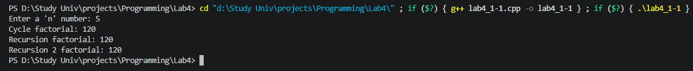
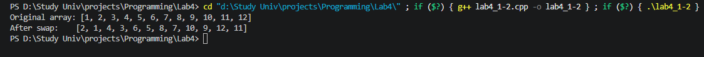
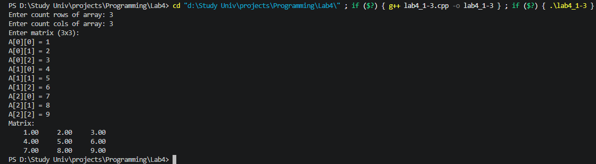
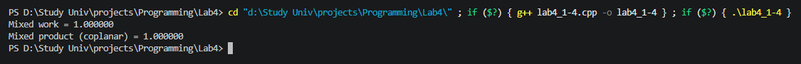
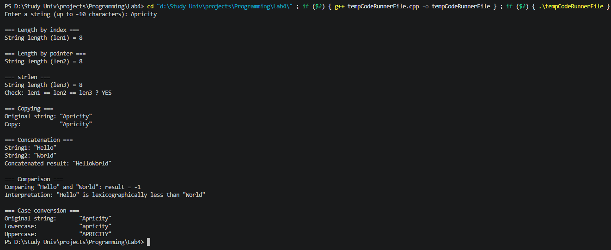
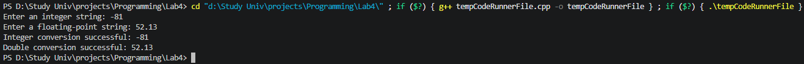
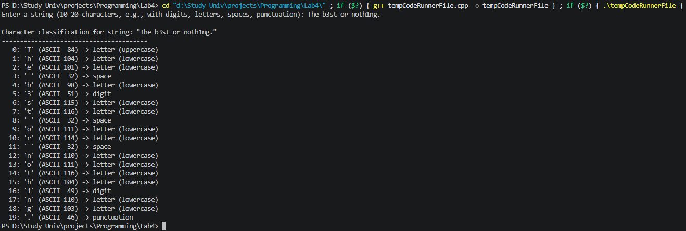

# **Лабораторная работа №4. Введение в функции. Базовая работа со строками**

## **Задача 1.1 \- Факториал: цикл и рекурсия**

### **Постановка задачи**

Реализовать функции вычисления факториала числа *n*: обычным циклом и рекурсией.

### **Математическая модель**

Факториал числа *n* ($n!$) определяется как:

$$n! = \prod_{i=1}^{n} i = 1 \cdot 2 \cdot 3 \cdot \ldots \cdot n$$

Рекурсивное определение:

$$n! = \begin{cases} 1, & \text{если } n = 0 \text{ или } n = 1 \\ n \cdot (n-1)!, & \text{если } n > 1 \end{cases}$$


### **Список идентификаторов**

| Имя переменной | Тип данных | Смысловое обозначение |
| - | - | - |
| n | int | Число, для которого вычисляется факториал |
| i | int | Счётчик цикла |
| fact | long long | текущее значение факториала |

### **Код программы**

```c
#include <stdio.h>
#include <stdlib.h>

long long factorial_cycle(int n) {
    long long fact = 1;

    for (int i = 2; i <= n; i++) {
        fact *= i;
    }
    
    return fact;
}

// Обычная рекурсия
long long factorial_recursion(long long n) {
    return n <= 1 ? 1 : n * factorial_recursion(n - 1);
}

// Хвостовая рекурсия
long long factorial_recursion2(int n, long long fact) {
    return n <= 1 ? fact : factorial_recursion2(n - 1, fact * n);
}

int main() {
    int n;
    printf("Enter a 'n' number: ");
    scanf("%d", &n);
    printf("Cycle factorial: %lld\n", factorial_cycle(n));
    printf("Recursion factorial: %lld\n", factorial_recursion(n));
    printf("Recursion 2 factorial: %lld", factorial_recursion2(n, 1));
}
```

### **Результаты выполненной работы**



## **Задача 1.2 \- Обмен чётных/нечётных ячеек массива**

### **Постановка задачи**

Отработать передачу динамического массива в функцию и изменение данных “по месту”

### **Математическая модель**

Для каждого чётного индекса $i$ от $0$ до $N-2$ с шагом $2$ выполняется перестановка:  

$$
\text{temp} = A[i] \\
A[i] = A[i+1] \\
A[i+1] = \text{temp}
$$

### **Список идентификаторов**

| Имя переменной | Тип данных | Смысловое обозначение |
| - | - | - |
| array | int* | Указатель на первый элемент массива |
| size | int | Размер массива |
| i | int | Индекс цикла для обхода массива |
| temp | int | Временная переменная для обмена значений |

### **Код программы**

```C
#include <stdio.h>
#include <stdlib.h>

void swap_pairs(int *arr, int size) {
    for (int i = 0; i < size - 1; i += 2) {
        int temp = arr[i];
        arr[i] = arr[i + 1];
        arr[i + 1] = temp;
    }
}

void print_array(const int *arr, int size) {
    printf("[");
    for (int i = 0; i < size; i++) {
        printf("%d", arr[i]);
        if (i < size - 1) printf(", ");
    }
    printf("]\n");
}

int main() {
    int size = 12;

    int *array = (int*)malloc(size * sizeof(int));
    if (array == NULL) {
        printf("Memory allocation failed!\n");
        return 1;
    }

    for (int i = 0; i < size; i++) {
        array[i] = i + 1;
    }

    printf("Original array: ");
    print_array(array, size);

    swap_pairs(array, size);

    printf("After swap:    ");
    print_array(array, size);

    free(array);

    return 0;
}
```

### **Результаты выполненной работы**



## **Задача 1.3 \- Набор функции для матрицы double**

### **Постановка задачи**

Выделять, заполнять, печатать и освобождать двумерный динамический массив без утечек памяти.

### **Математическая модель**

Матрица $M$ размером $R \times C$ создаётся как массив из $R$ указателей на строки, каждая из которых содержит $C$ элементов типа double. Освобождение памяти производится строго в обратном порядке.


### **Список идентификаторов**

| Имя переменной | Тип данных | Смысловое обозначение |
| - | - | - |
| rows | int | Количество строк матрицы |
| cols | int | Количество столбцов матрицы |
| matrix | double\*\* | Указатель на двумерный динамический массив |

### **Код программы**

```C
#include <stdio.h>
#include <stdlib.h>

double** allocate_matrix(int rows, int cols) {
    double **matrix = (double**)malloc(rows * sizeof(double*));
    if (matrix == NULL) {
        return NULL;
    }

    for (int i = 0; i < rows; i++) {
        matrix[i] = (double*)malloc(cols * sizeof(double));
        if (matrix[i] == NULL) {
            for (int k = 0; k < i; k++) {
                free(matrix[k]);
            }
            free(matrix);
            return NULL;
        }
    }
    return matrix;
}

void free_matrix(double **matrix, int rows) {
    if (matrix == NULL) return;
    for (int i = 0; i < rows; i++) {
        free(matrix[i]);
    }
    free(matrix);
}

void fill_matrix(double **matrix, int rows, int cols) {
    printf("Enter matrix (%dx%d):\n", rows, cols);
    for (int i = 0; i < rows; i++) {
        for (int j = 0; j < cols; j++) {
            printf("A[%d][%d] = ", i, j);
            scanf("%lf", &matrix[i][j]);
        }
    }
}

void print_matrix(double **matrix, int rows, int cols) {
    printf("Matrix:\n");
    for (int i = 0; i < rows; i++) {
        for (int j = 0; j < cols; j++) {
            printf("%8.2f ", matrix[i][j]);
        }
        printf("\n");
    }
}

int main() {
    int rows, cols;

    printf("Enter count rows of array: ");
    scanf("%d", &rows);
    printf("Enter count cols of array: ");
    scanf("%d", &cols);

    double **matrix = allocate_matrix(rows, cols);
    if (matrix == NULL) {
        printf("Memory allocation failed!\n");
        return 1;
    }

    fill_matrix(matrix, rows, cols);

    print_matrix(matrix, rows, cols);

    free_matrix(matrix, rows);

    return 0;
}
```

### **Результаты выполненной работы**



## **Задача 1.4 \- Смешанное произведение трёх векторов в 3D**

### **Постановка задачи**

Вычислять смешанное произведение через разбиение задачи на небольшие понятные функции

### **Математическая модель**

Скалярное произведение:
$$\vec{a} \cdot \vec{b} = a_x b_x + a_y b_y + a_z b_z$$

Векторное произведение:
$$\vec{a} \times \vec{b} = (a_y b_z - a_z b_y, a_z b_x - a_x b_z, a_x b_y - a_y b_x)$$

Смешанное произведение:
$$(\vec{a}, \vec{b}, \vec{c}) = (\vec{a} \times \vec{b}) \cdot \vec{c}$$

### **Список идентификаторов**

| Имя переменной | Тип данных | Смысловое обозначение |
| - | - | - |
| a, b, c | double[3] | Координаты трёх исходных векторов |

### **Код программы**

```C
#include <stdio.h>
#include <stdlib.h>

void cross3(const double a[3], const double b[3], double out[3]) {
    out[0] = a[1] * b[2] - a[2] * b[1];
    out[1] = a[2] * b[0] - a[0] * b[2];
    out[2] = a[0] * b[1] - a[1] * b[0];
}

double dot3(const double a[3], const double b[3]) {
    return a[0] * b[0] + a[1] * b[1] + a[2] * b[2];
}

double triple3(const double a[3], const double b[3], const double c[3]) {
    double tmp[3];
    cross3(b, c, tmp);
    return dot3(a, tmp);
}

int main() {
    double a[3] = {1.0, 0.0, 0.0};
    double b[3] = {0.0, 1.0, 0.0};
    double c[3] = {0.0, 0.0, 1.0};

    double result = triple3(a, b, c);
    printf("Mixed work = %f\n", result);

    double d[3] = {1.0, 1.0, 0.0};
    double e[3] = {2.0, 0.0, 0.0};
    double f[3] = {0.0, 3.0, 0.0};
    printf("Mixed product (coplanar) = %f\n", triple3(d, e, f));

    return 0;
}
```

### **Результаты выполненной работы**



## **Задача 2.1 \- Базовые строковые операции**

### **Постановка задачи**

Освоить базовые операции с C-строкой в максимально пошаговом режиме


### **Список идентификаторов**

| Имя переменной | Тип данных | Смысловое обозначение |
| - | - | - |
| my_string	| char[]	| Введённый пользователем текст |
| len	| size_t	| Общая длина текста для удаления переноса строки |
| len1	| int	| Длина текста, подсчитанная по символам |
| len2	| int	| Длина текста, подсчитанная через адрес в памяти |
| p	| char* |	Указатель для перемещения вдоль текста |
| len3	| size_t	| Длина текста, полученная готовой функцией strlen |
| copy	| char[]	| Буфер, куда копируется исходный текст |
| str1	| char[]	| Первая строка ("Hello") для склеивания и сравнения |
| str2	| char[]	| Вторая строка ("World") для склеивания и сравнения |
| result |	char[]	| Итоговая большая строка после склеивания |
| idx	| int	| Текущая позиция при сборке итоговой строки |
| cmp	| int	| Результат сравнения строк по алфавиту | 
| lower	| char[]	| Готовый текст в маленьких буквах |
| upper	| char[]	| Готовый текст в больших буквах |
| ch	| unsigned char	| Текущий символ, взятый для изменения регистра |

### **Код программы**

```C
#include <stdio.h>
#include <string.h>
#include <ctype.h>

#define MY_SIZE 32
#define BUF_SIZE 64

int main() {
    // Ввод строки
    char my_string[MY_SIZE];
    printf("Enter a string (up to ~10 characters): ");
    fgets(my_string, MY_SIZE, stdin);
    size_t len = strlen(my_string);
    if (len > 0 && my_string[len-1] == '\n') {
        my_string[len-1] = '\0';
    }

    // Ручной подсчёт по индексам
    int len1 = 0;
    for (int i = 0; my_string[i] != '\0'; i++) {
        len1++;
    }
    printf("\n=== Length by index ===\n");
    printf("String length (len1) = %d\n", len1);

    // Ручной подсчёт по указателю
    int len2 = 0;
    char *p = my_string;
    while (*p != '\0') {
        len2++;
        p++;
    }
    printf("\n=== Length by pointer ===\n");
    printf("String length (len2) = %d\n", len2);

    // Функция strlen
    size_t len3 = strlen(my_string);
    printf("\n=== strlen ===\n");
    printf("String length (len3) = %zu\n", len3);
    printf("Check: len1 == len2 == len3 ? %s\n",
           (len1 == (int)len2 && len1 == (int)len3) ? "YES" : "NO");

    // Копирование во второй буфер
    char copy[MY_SIZE];
    int i = 0;
    while (my_string[i] != '\0') {
        copy[i] = my_string[i];
        i++;
    }
    copy[i] = '\0';

    printf("\n=== Copying ===\n");
    printf("Original string: \"%s\"\n", my_string);
    printf("Copy:            \"%s\"\n", copy);

    // Конкатенация двух строк
    char str1[] = "Hello";
    char str2[] = "World";
    char result[BUF_SIZE];

    int idx = 0;
    while (str1[idx] != '\0') {
        result[idx] = str1[idx];
        idx++;
    }
    int j = 0;
    while (str2[j] != '\0') {
        result[idx] = str2[j];
        idx++;
        j++;
    }
    result[idx] = '\0';

    printf("\n=== Concatenation ===\n");
    printf("String1: \"%s\"\n", str1);
    printf("String2: \"%s\"\n", str2);
    printf("Concatenated result: \"%s\"\n", result);

    // Сравнение строк
    int cmp = strcmp(str1, str2);
    printf("\n=== Comparison ===\n");
    printf("Comparing \"%s\" and \"%s\": result = %d\n", str1, str2, cmp);
    if (cmp < 0) {
        printf("Interpretation: \"%s\" is lexicographically less than \"%s\"\n", str1, str2);
    } else if (cmp == 0) {
        printf("Interpretation: strings are equal\n");
    } else {
        printf("Interpretation: \"%s\" is lexicographically greater than \"%s\"\n", str1, str2);
    }

    // Перевод регистра
    char lower[MY_SIZE];
    char upper[MY_SIZE];
    int k = 0;
    while (my_string[k] != '\0') {
        unsigned char ch = (unsigned char)my_string[k];
        lower[k] = tolower(ch);
        upper[k] = toupper(ch);
        k++;
    }
    lower[k] = '\0';
    upper[k] = '\0';

    printf("\n=== Case conversion ===\n");
    printf("Original string:       \"%s\"\n", my_string);
    printf("Lowercase:             \"%s\"\n", lower);
    printf("Uppercase:             \"%s\"\n", upper);

    return 0;
}
```

### **Результаты выполненной работы**



## **Задача 2.2 \- Конвертация строк в числа**

### **Постановка задачи**

Безопасно преобразовывать текст в int и double, чтобы программа корректно реагировала на ошибочный ввод

### **Список идентификаторов**

| Имя переменной | Тип данных | Смысловое обозначение |
| - | - | - |
| str |	const char*	| Исходная строка с текстом для проверки и парсинга |
| out	| int* / double*	| Указатель на место в памяти, куда запишется готовое число |
| endptr |	char*	| Указатель на символ, на котором остановился разбор строки |
| val	| long / double	| Временная переменная для хранения считанного из строки числа |
| input_int	| char[]	| Текст с целым числом, который ввёл пользователь |
| input_double |	char[]	| Текст с дробным числом, который ввёл пользователь |
| len	| size_t	| Длина введённого текста для удаления переноса строки |
| int_val	| int	| Переменная для хранения итогового целого числа |
| ok_int	| int	| Флаг успешности перевода строки в целое число |
| double_val	| double	Переменная для хранения итогового дробного числа |
| ok_double	| int	| Флаг успешности перевода строки в дробное число |

### **Код программы**

```C
#include <stdio.h>
#include <stdlib.h>
#include <errno.h>
#include <limits.h>
#include <string.h>

// Преобразование в int. При успехе 1, иначе 0
int safe_str_to_int(const char *str, int *out) {
    errno = 0;
    char *endptr;
    long val = strtol(str, &endptr, 10);

    if (endptr == str) {
        printf("Error: no numeric characters found.\n");
        return 0;
    }

    if (errno == ERANGE) {
        printf("Error: value out of range for long.\n");
        return 0;
    }

    if (*endptr != '\0') {
        printf("Error: extra characters after number: \"%s\"\n", endptr);
        return 0;
    }

    if (val < INT_MIN || val > INT_MAX) {
        printf("Error: value out of range for int.\n");
        return 0;
    }

    *out = (int)val;
    return 1;
}

// Преобразование в double. При успехе 1, иначе 0
int safe_str_to_double(const char *str, double *out) {
    errno = 0;
    char *endptr;
    double val = strtod(str, &endptr);

    if (endptr == str) {
        printf("Error: no numeric characters found.\n");
        return 0;
    }

    if (errno == ERANGE) {
        printf("Error: value out of range for double (overflow or underflow).\n");
        return 0;
    }

    if (*endptr != '\0') {
        printf("Error: extra characters after number: \"%s\"\n", endptr);
        return 0;
    }

    *out = val;
    return 1;
}

int main() {
    char input_int[100];
    char input_double[100];

    printf("Enter an integer string: ");
    fgets(input_int, sizeof(input_int), stdin);
    size_t len = strlen(input_int);
    if (len > 0 && input_int[len-1] == '\n') {
        input_int[len-1] = '\0';
    }

    printf("Enter a floating-point string: ");
    fgets(input_double, sizeof(input_double), stdin);
    len = strlen(input_double);
    if (len > 0 && input_double[len-1] == '\n') {
        input_double[len-1] = '\0';
    }

    int int_val;
    int ok_int = safe_str_to_int(input_int, &int_val);
    if (ok_int) {
        printf("Integer conversion successful: %d\n", int_val);
    } else {
        printf("Integer conversion failed.\n");
    }

    double double_val;
    int ok_double = safe_str_to_double(input_double, &double_val);
    if (ok_double) {
        printf("Double conversion successful: %g\n", double_val);
    } else {
        printf("Double conversion failed.\n");
    }

    return 0;
}
```

### **Результаты выполненной работы**



## **Задача 2.3 \- Классификация символов**

### **Постановка задачи**

Научиться классифицировать каждый символ строки с помощью функций из ctype.h

### **Список идентификаторов**

| Имя переменной | Тип данных | Смысловое обозначение |
| - | - | - |
| ch |	unsigned char |	Текущий проверяемый символ |
| printed | int |	Флаг, показывающий, что тип символа уже определён |
| input | char[] |	Введённый пользователем текст для анализа |
| len |	size_t |	Общая длина текста для ограничения цикла |

### **Код программы**

```C
#include <stdio.h>
#include <string.h>
#include <ctype.h>

#define MAX_LEN 128


void print_char_classification(unsigned char ch, int index) {
    printf("  %2d: '%c' (ASCII %3d) -> ", index, ch, ch);

    int printed = 0;

    if (isdigit(ch)) {
        printf("digit ");
        printed = 1;
    }
    if (isalpha(ch)) {
        printf("letter ");
        printed = 1;
        if (islower(ch))
            printf("(lowercase) ");
        else if (isupper(ch))
            printf("(uppercase) ");
    }
    if (isspace(ch)) {
        printf("space ");
        printed = 1;
    }
    if (ispunct(ch)) {
        printf("punctuation ");
        printed = 1;
    }

    if (isalnum(ch) && !printed) {
        printf("alphanumeric ");
        printed = 1;
    }
    if (iscntrl(ch)) {
        printf("control ");
        printed = 1;
    }
    if (isxdigit(ch) && !isdigit(ch) && !isalpha(ch)) {
    }

    if (!printed) {
        printf("other (or unknown)");
    }
    printf("\n");
}

int main() {
    char input[MAX_LEN];

    printf("Enter a string (10-20 characters, e.g., with digits, letters, spaces, punctuation): ");
    if (fgets(input, sizeof(input), stdin) == NULL) {
        printf("Input error.\n");
        return 1;
    }

    size_t len = strlen(input);
    if (len > 0 && input[len-1] == '\n') {
        input[len-1] = '\0';
        len--;
    }

    printf("\nCharacter classification for string: \"%s\"\n", input);
    printf("----------------------------------------\n");

    for (int i = 0; i < (int)len; i++) {
        unsigned char ch = (unsigned char)input[i];
        print_char_classification(ch, i);
    }

    return 0;
}
```

### **Результаты выполненной работы**



## Информация о студенте

Хубларян Эдуард, 1 курс, ИВТ, 1 гр. 1 п.гр