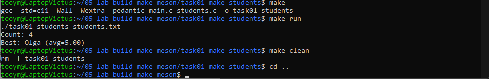
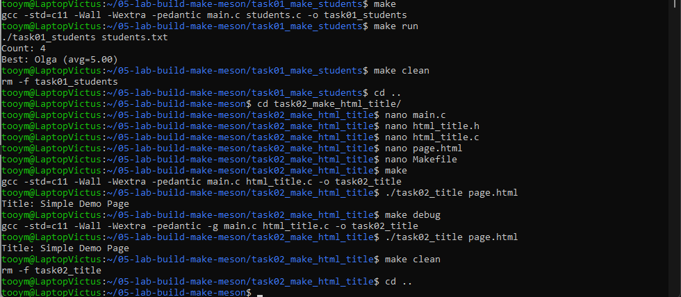
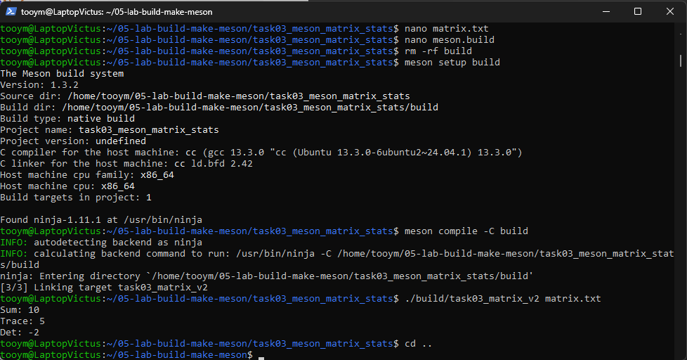
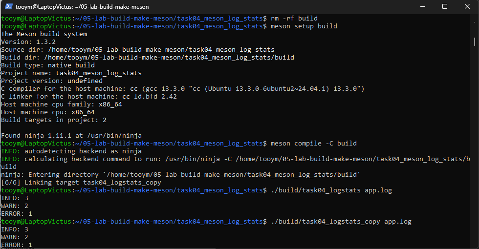

# Лабораторная работа №5. Сборка С-проектов (Make, Meson, CMake)


### Задача 1.1 - Лучший студент по среднему баллу

#### Постановка задачи

В первом мини-проекте программа читает текстовый файл со списком студентов и оценок, вычисляет средний балл каждого студента и выводит имя студента с максимальным средним баллом. Учебная цель задачи состоит в том, чтобы собрать C-проект из двух исходных модулей с помощью Makefile и добавить удобную цель run для запуска программы на учебном входном файле.

#### Математическая модель

Каждая запись о студенте представляется как элемент множества $S$, где каждый студент $s \in S$ является кортежем параметров:
   $$s = \langle \text{name}, \text{score}_1, \text{score}_2, \text{score}_3, \text{avg} \rangle$$
   
   Где $\text{name}$ — строка символов, $\text{score}_i \in \mathbb{N}$ — оценки по предметам, а $\text{avg} \in \mathbb{R}$ — средний балл, вычисляемый по формуле:
   $$\text{avg} = \frac{\text{score}_1 + \text{score}_2 + \text{score}_3}{3.0}$$

   Задача поиска сводится к нахождению индекса элемента $best$ в массиве студентов $A$ длины $count$, для которого средний балл является максимальным:
   $$\text{best} = \arg\max_{0 \le i < \text{count}} (A[i].\text{avg})$$

#### Список идентификаторов

| Имя переменной | Тип данных |   Описание                |
|-|-|-|
| students / arr	| Student[]	| Список всех студентов с их оценками |
| path / filename	| const char*	| Путь к файлу с данными студентов |
| count	| int	| Общее количество студентов |
| best	| int	| Номер самого лучшего студента в списке |
| name	| char[]	| Имя конкретного студента |
| score1, score2, score3	| int	| Три оценки студента по предметам |
| avg	| double	| Средний балл студента |
| f	| FILE*	| Сам файл со студентами |
| s	| Student	| Данные одного студента при чтении |

#### Код программы

Файл main.c:
```c
#include "students.h"

#include <stdio.h>

int main(int argc, char *argv[]) {
    Student students[100];
    const char *path = "students.txt";
    int count;
    int best;

    if (argc > 1) {
        path = argv[1];
    }

    count = load_students(path, students, 100);
    if (count <= 0) {
        printf("Cannotreadstudents file: %s\n", path);
        return 1;
    }

    best = find_best_student(students, count);

    printf("Count: %d\n", count);
    printf("Best: %s (avg=%.2f)\n", students[best].name, students[best].avg);
    
    return 0;
}
```
Файл students.h:
```C
#ifndef STUDENTS_H
#define STUDENTS_H

typedef struct {
    char name[64];
    int score1;
    int score2;
    int score3;
    double avg;
} Student;

int load_students(const char *filename, Studentarr[], int max_count);
int find_best_student(const Student arr[], int count);

#endif
```
Файл students.c:
```C
#include "students.h"

#include <stdio.h>

int load_students(const char *filename, Studentarr[], int max_count) {
    FILE *f = fopen(filename, "r");
    int count = 0;

    if (!f) {
        return -1;
    }

    while (count < max_count) {
        Student s;
        int n = fscanf(f, "%63[^,],%d,%d,%d", s.name, &s.score1, &s.score2, &s.score3);
        if (n != 4) {
            break;
        }

        s.avg = (s.score1 + s.score2 + s.score3) / 3.0;
        arr[count] = s;
        count++;
    }

    fclose(f);
    return count;
}

int find_best_student(const Student arr[], int count) {
    int best = 0;
    int i;
    
    for (i = 1; i < count; i++) {
        if (arr[i].avg > arr[best].avg) {
            best = i;
        }
    }

    return best;
}
```
Файл Makefile:
```Makefile
CC= gcc
CFLAGS = -std=c11 -Wall -Wextra -pedantic
TARGET = task01_students
SRC = main.c students.c

all: $(TARGET)

$(TARGET): $(SRC)
    $(CC) $(CFLAGS) $(SRC) -o $(TARGET)

run: $(TARGET)
    ./$(TARGET) students.txt

clean:
    rm-f $(TARGET)
```

#### Результат работы программы



### Задача 1.2 - Извлечение \<title> из HTML

#### Постановка задачи

Во втором мини-проекте программа читает локальный HTML-файл и извлекает текст между тегами \<title> и \</title>. Учебная цель задачи состоит в том, чтобы закрепить обычную сборку через make и добавить отдельную цель debug, которая собирает программу с флагом -g для отладочной информации.

#### Список идентификаторов

| Имя переменной | Тип данных |   Описание                 |
|-|-|-|
| html	| char[]	| Буфер, куда загружается весь текст HTML-страницы |
| title	| char[]	| Строка, куда копируется найденный заголовок страницы |
| path	| const char*	| Путь к открываемому HTML-файлу |
| start	| const char*	| Указатель на начало текста внутри тега заголовка |
| end	| const char*	| Указатель на конец текста (начало закрывающего тега) |
| len	| size_t	| Итоговая длина чистого текста заголовка |
| open_tag	| const char*	| Строка с открывающим тегом, который нужно найти |
| close_tag	| const char*	| Строка с закрывающим тегом, который нужно найти |

#### Код программы

Файл main.c
```c
#include "html_title.h"

#include <stdio.h>

int main(int argc, char *argv[]) {
    char html[8192];
    char title[256];
    const char *path = "page.html";

    if (argc > 1) {
        path = argv[1];
    }

    if (load_text_file(path, html, sizeof(html)) != 0) {
        printf("Cannotreadhtmlfile: %s\n", path);
        return 1;
    }

    if (extract_title(html, title, sizeof(title)) != 0) {
        printf("Tag <title>notfound\n");
        return 1;
    }

    printf("Title: %s\n", title);

    return 0;
}
```
Файл html_title.h
```c
#ifndef HTML_TITLE_H
#define HTML_TITLE_H

#include <stddef.h>

int load_text_file(const char *filename, char *buffer, size_t buffer_size);
int extract_title(const char *html, char *title, size_t title_size);

#endif
```
Файл html_title.c
```c
#include "html_title.h"

#include <stdio.h>
#include <string.h>

int load_text_file(const char *filename, char *buffer, size_t buffer_size) {
    FILE *f;
    size_t n;
    
    f = fopen(filename, "r");
    if (!f) {
        return -1;
    }

    n = fread(buffer, 1, buffer_size- 1, f);
    buffer[n] = '\0';

    fclose(f);
    return 0;
}

int extract_title(const char *html, char *title, size_t title_size) {
    const char *open_tag = "<title>";
    const char *close_tag = "</title>";
    const char *start;
    const char *end;
    size_t len;

    start = strstr(html, open_tag);
    if (!start) {
        return -1;
    }

    start += strlen(open_tag);
    end = strstr(start, close_tag);
    if (!end) {
        return -1;
    }

    len = (size_t)(end- start);
    if (len >= title_size) {
        len = title_size- 1;
    }

    memcpy(title, start, len);
    title[len] = '\0';

    return 0;
}
```
Файл Makefile
```Makefile
CC = gcc
CFLAGS = -std=c11 -Wall -Wextra -pedantic
TARGET = task02_title
SRC = main.c html_title.c
all: $(TARGET)

$(TARGET): $(SRC)
    $(CC) $(CFLAGS) $(SRC) -o $(TARGET)

debug:
    $(CC) $(CFLAGS) -g $(SRC) -o $(TARGET)

clean:
    rm-f $(TARGET)
```

#### Результат работы программы



### Задача 2.1 - Статистика матрицы 2х2

#### Постановка задачи

В третьем мини-проекте программа читает матрицу 2x2 из текстового файла и вычисляет сумму элементов, след и определитель. Учебная цель задачи состоит в том, чтобы выполнить базовый цикл работы с Meson: описать проект в meson.build, создать каталог сборки, собрать программу и запустить полученный исполняемый файл.

#### Математическая модель

   $$\text{Sum} = m_{00} + m_{01} + m_{10} + m_{11}$$

   $$\text{Trace} = m_{00} + m_{11}$$

   $$\text{Det} = m_{00} \cdot m_{11} - m_{01} \cdot m_{10}$$

#### Список идентификаторов

| Имя переменной | Тип данных |   Описание                 |
|-|-|-|
| m	| int[2][2]	| Матрица целых чисел размера 2x2 |
| path / filename	| const char*	| Путь к файлу с элементами матрицы |
| f	| FILE*	| Файл, из которого считывается матрица |

#### Код программы

Файл main.c:
```c
#include "matrix_stats.h"

#include <stdio.h>

int main(int argc, char *argv[]) {
    int m[2][2];
    const char *path = "matrix.txt";

    if (argc > 1) {
        path = argv[1];
    }

    if (read_matrix_2x2(path, m) != 0) {
        printf("Cannotreadmatrixfile: %s\n", path);
        return 1;
    }

    printf("Sum: %d\n", matrix_sum_2x2(m));
    printf("Trace: %d\n", matrix_trace_2x2(m));
    printf("Det: %d\n", matrix_det_2x2(m));

    return 0;
}
```
Файл matrix_stats.h:
```c
#ifndef MATRIX_STATS_H
#define MATRIX_STATS_H

int read_matrix_2x2(const char *filename, int m[2][2]);
int matrix_sum_2x2(const int m[2][2]);
int matrix_trace_2x2(const int m[2][2]);
int matrix_det_2x2(const int m[2][2]);

#endif
```
Файл matrix_stats.c:
```c
#include "matrix_stats.h"

#include <stdio.h>

int read_matrix_2x2(const char *filename, int m[2][2]) {
    FILE *f;
    f = fopen(filename, "r");

    if (!f) {
        return -1;
    }

    if (fscanf(f, "%d %d %d %d", &m[0][0], &m[0][1], &m[1][0], &m[1][1]) != 4) {
        fclose(f);
        return -1;
    }

    fclose(f);
    return 0;
}

int matrix_sum_2x2(const int m[2][2]) {
    return m[0][0] + m[0][1] + m[1][0] + m[1][1];
}

int matrix_trace_2x2(const int m[2][2]) {
    return m[0][0] + m[1][1];
}

int matrix_det_2x2(const int m[2][2]) {
    return m[0][0] * m[1][1]-m[0][1] * m[1][0];
}
```
Файл meson.build:
```meson.build
project('task03_meson_matrix_stats', 'c', default_options : ['c_std=c11', 'warning_level=2'])

executable('task03_matrix_v2', ['main.c', 'matrix_stats.c'])
```

#### Результат работы программы



### Задача 2.2 - Подсчёт INFO/WARN/ERROR

#### Постановка задачи

В четвёртом мини-проекте программа читает текстовый лог и считает строки с метками INFO, WARN и ERROR. Учебная цель задачи состоит в том, чтобы объявить в одном meson.build две исполняемые цели, которые используют один и тот же набор исходных файлов.

#### Список идентификаторов

| Имя переменной | Тип данных |   Описание                 |
|-|-|-|
| stats	| LogStats / LogStats*	| Структура, где хранятся счётчики для каждого типа логов |
| path / filename	| const char*	| Путь к анализируемому лог-файлу |
| info_count	| int	| Количество найденных строк с пометкой INFO |
| warn_count	| int	| Количество найденных строк с пометкой WARN |
| error_count	| int	| Количество найденных строк с пометкой ERROR |
| f	| FILE*	| Открытый файл логов для чтения |
| line	| char[]	| Временный буфер для хранения одной текущей строки из файла |

#### Код программы

Файл main.c:
```c
#include "log_stats.h"

#include <stdio.h>

int main(int argc, char *argv[]) {
    LogStats stats;
    const char *path = "app.log";

    if (argc > 1) {
        path = argv[1];
    }

    if (analyze_log_file(path, &stats) != 0) {
        printf("Cannotreadlogfile: %s\n", path);
        return 1;
    }

    printf("INFO: %d\n", stats.info_count);
    printf("WARN: %d\n", stats.warn_count);
    printf("ERROR: %d\n", stats.error_count);
    
    return 0;
}
```
Файл log_stats.h:
```c
#ifndef LOG_STATS_H
#define LOG_STATS_H

typedef struct {
    int info_count;
    int warn_count;
    int error_count;
} LogStats;

int analyze_log_file(const char *filename, LogStats *stats);

#endif
```
Файл log_stats.c:
```c
#include "log_stats.h"

#include <stdio.h>
#include <string.h>

int analyze_log_file(const char *filename, LogStats *stats) {
    FILE *f;
    char line[512];

    f = fopen(filename, "r");
    if (!f) {
        return -1;
    }

    stats->info_count = 0;
    stats->warn_count = 0;
    stats->error_count = 0;

    while (fgets(line, sizeof(line), f)) {
        if (strstr(line, "INFO") != NULL) {
            stats->info_count++;
        } else if (strstr(line, "WARN") != NULL) {
            stats->warn_count++;
        } else if (strstr(line, "ERROR") != NULL) {
            stats->error_count++;
        }
    }

    fclose(f);
    return 0;
}
```
Файл meson.build:
```meson.build
project('task04_meson_log_stats', 'c', default_options : ['c_std=c11', 'warning_level=2'])

executable('task04_logstats', ['main.c', 'log_stats.c'])
executable('task04_logstats_copy', ['main.c', 'log_stats.c'])
```

#### Результат работы программы



## Информация о студенте

Хубларян Эдуард, 1 курс, ИВТ, 1 гр. 1 п.гр
