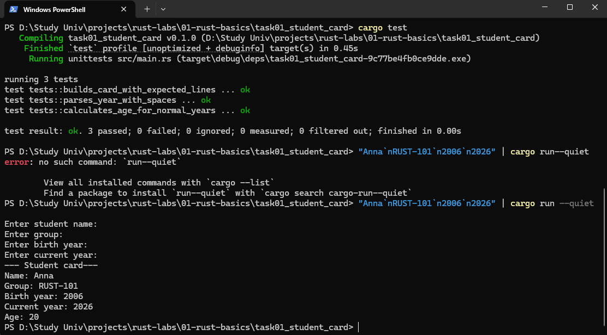
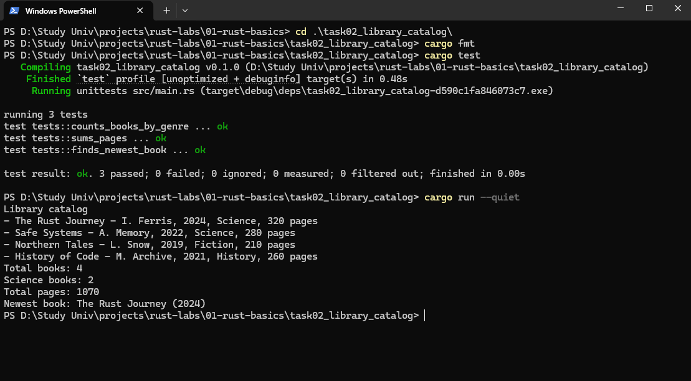

# Лабораторная работа №1. Rust: первые программы, функции, структуры и перечисления


### Задача 1.1 - Карточка студента

#### Постановка задачи

В этой задаче программа запрашивает у пользователя имя, группу, год рождения и текущий год, после чего выводит аккуратную карточку студента. На небольшом примере осваиваются переменные, строки String, чтение из стандартного ввода, преобразование текста в число и выделение повторяемой логики в функции.

#### Список идентификаторов

| Имя переменной | Тип данных |   Описание                |
|-|-|-|
| prompt	| &str	| Текст приглашения к вводу для пользователя |
| input / text	| String / &str	| Строка, введённая пользователем с клавиатуры |
| birth_year	| u32	| Год рождения студента числом |
| current_year	| u32	| Текущий год числом |
| age	| u32	| Вычисленный возраст студента |
| name	| &str / String	| Имя студента |
| group	| &str / String	| Учебная группа студента |
| card	| String	| Готовый сформированный студенческий билет в виде текста |
| birth_year_text	| String	| Текстовое представление года рождения до перевода в число |
| current_year_text	| String	| Текстовое представление текущего года до перевода в число |

#### Код программы

Файл cargo.toml:
```cargo.toml
[package]
name = "task01_student_card"
version = "0.1.0"
edition = "2021"

[dependencies]
```
Файл main.rs:
```rust
use std::io;

fn read_trimmed_line(prompt: &str) -> String {
    println!("{}", prompt);

    let mut input = String::new();
    io::stdin()
        .read_line(&mut input)
        .expect("failed to read input line");

    input.trim().to_string()
}

fn parse_year(text: &str) -> u32 {
    text.trim()
        .parse::<u32>()
        .expect("year must be a positive integer")
}

fn calculate_age(birth_year: u32, current_year: u32) -> u32 {
    current_year.saturating_sub(birth_year)
}

fn build_student_card(name: &str, group: &str, birth_year: u32, current_year: u32) -> String {
    let age = calculate_age(birth_year, current_year);
    format!(
        "--- Student card---\nName: {name}\nGroup: {group}\nBirth year: {birth_year}\nCurrent year: {current_year}\nAge: {age}"
    )
}

fn main() {
    let name = read_trimmed_line("Enter student name:");
    let group = read_trimmed_line("Enter group:");
    let birth_year_text = read_trimmed_line("Enter birth year:");
    let current_year_text = read_trimmed_line("Enter current year:");

    let birth_year = parse_year(&birth_year_text);
    let current_year = parse_year(&current_year_text);

    let card = build_student_card(&name, &group, birth_year, current_year);
    println!("{}", card);
}

#[cfg(test)]
mod tests {
    use super::*;

    #[test]
    fn calculates_age_for_normal_years() {
        assert_eq!(calculate_age(2006, 2026), 20);
    }

    #[test]
    fn parses_year_with_spaces() {
        assert_eq!(parse_year(" 2026 "), 2026);
    }

    #[test]
    fn builds_card_with_expected_lines() {
        let card = build_student_card("Anna", "RUST-101", 2006, 2026);
        assert!(card.contains("Name: Anna"));
        assert!(card.contains("Group: RUST-101"));
        assert!(card.contains("Age: 20"));
    }
}
```

#### Результат работы программы



### Задача 1.2 - Мини-каталог книг

#### Постановка задачи

Во второй задаче программа создаёт небольшой каталог книг и выводит отчёт: список книг, общее количество, количество научных книг, сумму страниц и самую новую книгу. В задаче используются struct, enum, блоки impl, вектор Vec и функции, принимающие срез &[Book].

#### Список идентификаторов

| Имя переменной | Тип данных |   Описание                 |
|-|-|-|
| title	| &str / String	| Название книги |
| author	| &str / String	| Автор книги |
| year	| u16	| Год издания книги |
| genre	| Genre	| Жанр книги (наука, художка или история) |
| pages	| u16	| Количество страниц в книге |
| books	| &[Book] / Vec<Book>	| Список (коллекция) всех доступных книг |
| book	| &Book	| Конкретная выбранная книга при переборе или поиске |
| card	| String	| Текстовое описание книги, готовое для вывода |
| newest	| &Book	| Самая свежая (новая) книга, найденная в каталоге |
#### Код программы

Файл cargo.toml
```cargo.toml
[package]
name = "task02_library_catalog"
version = "0.1.0"
edition = "2021"

[dependencies]

```
Файл html_title.h
```rust
#[derive(Clone, Copy, Debug, PartialEq, Eq)]
enum Genre {
    Fiction,
    Science,
    History,
}

impl Genre {
    fn title(&self) -> &'static str {
        match self {
            Genre::Fiction => "Fiction",
            Genre::Science => "Science",
            Genre::History => "History",
        }
    }
}

#[derive(Debug)]
struct Book {
    title: String,
    author: String,
    year: u16,
    genre: Genre,
    pages: u16,
}

impl Book {
    fn new(title: &str, author: &str, year: u16, genre: Genre, pages: u16) -> Self {
        Self {
            title: title.to_string(),
            author: author.to_string(),
            year,
            genre,
            pages,
        }
    }

    fn describe(&self) -> String {
        format!(
            "{} - {}, {}, {}, {} pages",
            self.title,
            self.author,
            self.year,
            self.genre.title(),
            self.pages
        )
    }
}

fn total_pages(books: &[Book]) -> u32 {
    books.iter().map(|book| u32::from(book.pages)).sum()
}

fn count_by_genre(books: &[Book], genre: Genre) -> usize {
    books.iter().filter(|book| book.genre == genre).count()
}

fn newest_book(books: &[Book]) -> Option<&Book> {
    books.iter().max_by_key(|book| book.year)
}

fn main() {
    let books = vec![
        Book::new("The Rust Journey", "I. Ferris", 2024, Genre::Science, 320),
        Book::new("Safe Systems", "A. Memory", 2022, Genre::Science, 280),
        Book::new("Northern Tales", "L. Snow", 2019, Genre::Fiction, 210),
        Book::new("History of Code", "M. Archive", 2021, Genre::History, 260),
    ];

    println!("Library catalog");
    for book in &books {
        println!("- {}", book.describe());
    }

    println!("Total books: {}", books.len());
    println!("Science books: {}", count_by_genre(&books, Genre::Science));
    println!("Total pages: {}", total_pages(&books));

    if let Some(book) = newest_book(&books) {
        println!("Newest book: {} ({})", book.title, book.year);
    }
}

#[cfg(test)]
mod tests {
    use super::*;

    fn sample_books() -> Vec<Book> {
        vec![
            Book::new("A", "Author 1", 2020, Genre::Science, 100),
            Book::new("B", "Author 2", 2022, Genre::Fiction, 150),
            Book::new("C", "Author 3", 2021, Genre::Science, 200),
        ]
    }

    #[test]
    fn counts_books_by_genre() {
        let books = sample_books();

        assert_eq!(count_by_genre(&books, Genre::Science), 2);
        assert_eq!(count_by_genre(&books, Genre::History), 0);
    }

    #[test]
    fn sums_pages() {
        let books = sample_books();

        assert_eq!(total_pages(&books), 450);
    }

    #[test]
    fn finds_newest_book() {
        let books = sample_books();
        let newest = newest_book(&books).expect("samplelistisnotempty");

        assert_eq!(newest.title, "B");
        assert_eq!(newest.year, 2022);
    }
}
```

#### Результат работы программы



## Информация о студенте

Хубларян Эдуард, 1 курс, ИВТ, 1 гр. 1 п.гр
